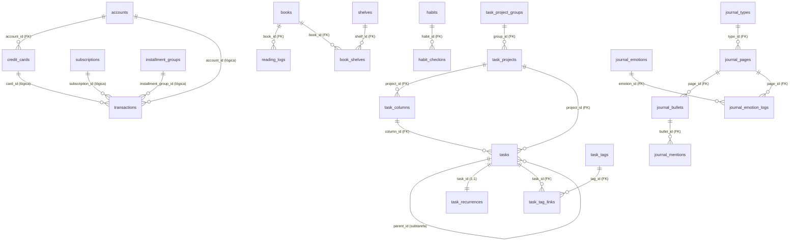

# Estrutura do PostgreSQL — makima_personal_agent

Referência completa do banco de dados PostgreSQL do Makima: todas as tabelas, coluna a coluna, com
índices, chaves estrangeiras (FKs), constraints e regras de negócio.

> **Como ler este documento:** cada tabela tem uma frase de propósito, uma tabela coluna-a-coluna,
> e listas de índices/FKs/CHECKs quando existem. Termos técnicos são explicados em linguagem simples.

---

## 1. Visão geral

O Makima usa **um único banco PostgreSQL compartilhado** por todos os agentes. Não há um banco por
agente — todos os domínios (finanças, livros, tarefas) vivem no mesmo banco, em tabelas com prefixos
diferentes.

- **Acesso ao banco:** centralizado em `agents/db.py`. Esse módulo expõe:
  - `get_conn()` — abre uma conexão psycopg2 com *commit* automático ao sair e *rollback* em caso de
    erro (é um *context manager*, usado com `with`).
  - `run_select(sql, params)` — executa um `SELECT` e devolve uma lista de dicionários (cada linha
    vira um `dict {coluna: valor}`). Campos `NUMERIC` são convertidos de `Decimal` para `float`
    automaticamente, para o código dos agentes poder fazer aritmética sem erro de tipo.
  - `run_dml(sql, params)` — executa `INSERT`/`UPDATE`/`DELETE` e devolve o número de linhas afetadas.
  - A conexão vem de `DATABASE_URL`. O ADK às vezes adiciona um sufixo de driver assíncrono
    (`+asyncpg`) na URL; o `_get_dsn()` remove esse sufixo porque as tools usam psycopg2 **síncrono**.

- **Criação das tabelas:** há **duas formas** de as tabelas nascerem:
  - O script `scripts/setup_schemas.py` aplica **três** arquivos `.sql`, nesta ordem (a ordem importa
    por causa das FKs entre domínios): `agents/nami/schema_pg.sql` (finanças) →
    `agents/frieren/schema_pg.sql` (livros) → `agents/kaguya/schema_tasks_pg.sql` (tarefas/hábitos).
  - O domínio **Journal** (diário) **não** está no `setup_schemas.py`: suas tabelas são criadas **sob
    demanda** por `agents/journal/tools.py` (`_ensure_tables()`), executado na importação do módulo.
  - As tabelas de **sessão do ADK** (histórico de conversa do Telegram) são criadas e gerenciadas
    pelo próprio `DatabaseSessionService` do ADK (ex.: `sessions`, `events`, `app_states`,
    `user_states`) — não estão em nenhum schema do repo e não são documentadas aqui.

  Todos os schemas do repo são **idempotentes** (`CREATE TABLE IF NOT EXISTS`,
  `CREATE INDEX IF NOT EXISTS`), então rodar de novo não dá erro nem duplica dados.

### Os quatro domínios (27 tabelas no total)

| Domínio | Onde | Tabelas |
|---|---|---|
| **Finanças** | Agente Nami | `transactions`, `subscriptions`, `installment_groups`, `accounts`, `credit_cards`, `loans`, `budgets` |
| **Livros** | Agente Frieren | `books`, `reading_logs`, `shelves`, `book_shelves` |
| **Tarefas / hábitos** | Agente Kaguya | `task_project_groups`, `task_projects`, `task_columns`, `tasks`, `task_recurrences`, `task_tags`, `task_tag_links`, `task_filters`, `habits`, `habit_checkins` |
| **Diário** (webapp-only) | `agents/journal` | `journal_types`, `journal_pages`, `journal_bullets`, `journal_mentions`, `journal_emotions`, `journal_emotion_logs` |

---

## 2. Diagrama de relacionamentos (ER)

O diagrama abaixo mostra as ligações entre as tabelas. Algumas ligações da Nami são **convenções de
código** (a coluna guarda o ID, mas não há `REFERENCES` declarado no banco) — estão anotadas como
"(lógica)". As demais são FKs declaradas de verdade no schema.



> `||--o{` = um-para-muitos · `||--||` = um-para-um · `task_tag_links` é uma tabela de ligação N:N
> (muitos-para-muitos) entre `tasks` e `task_tags`; `book_shelves` faz o mesmo entre `books` e `shelves`.

---

## 3. Domínio Nami — Finanças

Fonte: `agents/nami/schema_pg.sql`. Todos os IDs aqui são `TEXT` (UUIDs gerados no código, não pelo
banco).

### `transactions`

O coração do domínio financeiro: todo gasto, receita ou transferência é uma linha aqui.

| Coluna | Tipo | Nulo? | Default | Descrição |
|---|---|---|---|---|
| `id` | TEXT | PK | — | Identificador único (UUID gerado no código). |
| `name` | TEXT | NÃO | — | Nome/descrição da transação. |
| `valor` | NUMERIC | NÃO | — | Valor em reais. |
| `tipo` | TEXT | NÃO | — | `receita` \| `despesa` \| `transferencia`. |
| `categoria` | TEXT | NÃO | — | Categoria (ex.: Alimentacao, Lazer). Default lógico: `Inbox`. |
| `conta` | TEXT | NÃO | — | Nome da conta **ou** do cartão (campo *display* denormalizado, evita JOIN). |
| `account_id` | TEXT | SIM | — | FK lógica para `accounts.id`. Preenchido só em transação de **conta bancária**. |
| `card_id` | TEXT | SIM | — | FK lógica para `credit_cards.id`. Preenchido só em transação de **cartão**. |
| `data` | DATE | NÃO | — | Data da transação. |
| `notes` | TEXT | SIM | — | Anotações livres. |
| `subscription_id` | TEXT | SIM | — | Liga a uma assinatura (`subscriptions.id`), se a transação for a cobrança de uma. |
| `installment_group_id` | TEXT | SIM | — | Liga a um grupo de parcelamento (`installment_groups.id`). |
| `source` | TEXT | SIM | — | Origem do registro (ex.: "telegram"). |
| `created_at` | TIMESTAMPTZ | SIM | `NOW()` | Quando foi criada. |
| `updated_at` | TIMESTAMPTZ | SIM | `NOW()` | Última atualização. |
| `deleted` | BOOLEAN | SIM | `FALSE` | *Soft delete* — `TRUE` esconde a linha sem apagá-la. |

**Índices:** `idx_transactions_data` (data), `idx_transactions_categoria` (categoria),
`idx_transactions_conta` (conta), `idx_transactions_deleted` (deleted).

**Regra de ouro:** `account_id` e `card_id` são **mutuamente exclusivos** — nunca os dois ao mesmo
tempo. Conta bancária (débito, Pix, dinheiro) → `account_id` preenchido, `card_id` NULL. Cartão de
crédito (compra ou pagamento de fatura) → `card_id` preenchido, `account_id` NULL. A tabela
`transactions` é a **única fonte da verdade** para o saldo dos cartões (não existe tabela separada de
dívida de cartão).

### `subscriptions`

Assinaturas recorrentes (Netflix, Spotify, etc.).

| Coluna | Tipo | Nulo? | Default | Descrição |
|---|---|---|---|---|
| `id` | TEXT | PK | — | UUID. |
| `name` | TEXT | NÃO | — | Nome da assinatura. |
| `valor` | NUMERIC | NÃO | — | Valor por ciclo. |
| `ciclo` | TEXT | NÃO | — | `mensal` \| `anual` \| `trimestral`. |
| `next_billing` | DATE | SIM | — | Data da próxima cobrança. |
| `conta` | TEXT | SIM | — | Conta usada para pagar. |
| `categoria` | TEXT | SIM | — | Categoria do gasto. |
| `status` | TEXT | SIM | `'ativa'` | `ativa` / pausada / cancelada. |
| `notes` | TEXT | SIM | — | Anotações. |
| `created_at` | TIMESTAMPTZ | SIM | `NOW()` | Criação. |
| `updated_at` | TIMESTAMPTZ | SIM | `NOW()` | Atualização. |
| `deleted` | BOOLEAN | SIM | `FALSE` | *Soft delete*. |

**Índices:** `idx_subscriptions_status` (status).

### `installment_groups`

Cabeçalho de uma compra parcelada. As parcelas em si são linhas em `transactions` ligadas por
`installment_group_id`.

| Coluna | Tipo | Nulo? | Default | Descrição |
|---|---|---|---|---|
| `id` | TEXT | PK | — | UUID do grupo. |
| `name` | TEXT | NÃO | — | Nome da compra. |
| `total_valor` | NUMERIC | NÃO | — | Valor total (soma das parcelas). |
| `num_parcelas` | INTEGER | NÃO | — | Quantidade de parcelas. |
| `valor_parcela` | NUMERIC | NÃO | — | Valor de cada parcela. |
| `conta` | TEXT | SIM | — | Conta/cartão usado. |
| `categoria` | TEXT | SIM | — | Categoria. |
| `first_due` | DATE | SIM | — | Vencimento da 1ª parcela. |
| `notes` | TEXT | SIM | — | Anotações. |
| `created_at` | TIMESTAMPTZ | SIM | `NOW()` | Criação. |
| `deleted` | BOOLEAN | SIM | `FALSE` | *Soft delete*. |

### `accounts`

Contas financeiras — a fonte canônica de "onde está o dinheiro". **Cartões de crédito NÃO são contas**
(ficam em `credit_cards`).

| Coluna | Tipo | Nulo? | Default | Descrição |
|---|---|---|---|---|
| `id` | TEXT | PK | — | UUID da conta. |
| `name` | TEXT | NÃO | — | Nome da conta. |
| `institution` | TEXT | SIM | — | Banco/instituição. |
| `type` | TEXT | SIM | — | `corrente` \| `poupança` \| `dinheiro` \| `investimento`. |
| `balance_inicial` | NUMERIC | SIM | `0` | Saldo na data de início do rastreamento (base do cálculo de saldo atual). |
| `data_inicio` | DATE | SIM | — | A partir de quando o saldo é rastreado. |
| `status` | TEXT | SIM | `'ativa'` | `ativa` / encerrada. |
| `notes` | TEXT | SIM | — | Anotações. |
| `created_at` | TIMESTAMPTZ | SIM | `NOW()` | Criação. |
| `updated_at` | TIMESTAMPTZ | SIM | `NOW()` | Atualização. |

> Saldo atual = `balance_inicial` + receitas − despesas (calculado a partir de `transactions`).

### `credit_cards`

Cartões de crédito. Cada cartão é vinculado a uma conta (a conta de onde a fatura é paga).

| Coluna | Tipo | Nulo? | Default | Descrição |
|---|---|---|---|---|
| `id` | TEXT | PK | — | UUID do cartão. |
| `name` | TEXT | NÃO | — | Nome do cartão. |
| `account_id` | TEXT | SIM | — | **FK declarada** → `accounts(id)`. Conta que paga a fatura. |
| `limite` | NUMERIC | SIM | — | Limite de crédito. |
| `taxa_juros_mensal` | NUMERIC | SIM | — | Juros mensal (para simulações de dívida). |
| `closing_day` | INTEGER | SIM | — | Dia de fechamento da fatura. |
| `due_day` | INTEGER | SIM | — | Dia de vencimento da fatura. |
| `status` | TEXT | SIM | `'ativo'` | `ativo` / inativo. |
| `notes` | TEXT | SIM | — | Anotações. |
| `created_at` | TIMESTAMPTZ | SIM | `NOW()` | Criação. |
| `updated_at` | TIMESTAMPTZ | SIM | `NOW()` | Atualização. |

**FKs:** `account_id → accounts(id)`.

### `loans`

Empréstimos e financiamentos, com suporte a dois sistemas de amortização (PRICE = parcela fixa;
SAC = amortização fixa, juros decrescem).

| Coluna | Tipo | Nulo? | Default | Descrição |
|---|---|---|---|---|
| `id` | TEXT | PK | — | UUID. |
| `name` | TEXT | NÃO | — | Nome do empréstimo. |
| `tipo` | TEXT | SIM | — | Tipo (ex.: veiculo, pessoal, imovel). |
| `sistema_amortizacao` | TEXT | SIM | — | `PRICE` \| `SAC`. |
| `valor_original` | NUMERIC | SIM | — | Valor contratado. |
| `taxa_juros_mensal` | NUMERIC | SIM | — | Juros mensal. |
| `num_parcelas_total` | INTEGER | SIM | — | Total de parcelas. |
| `parcelas_pagas` | INTEGER | SIM | `0` | Quantas já foram pagas (avança em cada pagamento). |
| `valor_parcela` | NUMERIC | SIM | — | Valor da parcela (em PRICE; em SAC é a inicial). |
| `primeiro_vencimento` | DATE | SIM | — | Vencimento da 1ª parcela. |
| `conta` | TEXT | SIM | — | Conta de pagamento. |
| `desconto_folha` | BOOLEAN | SIM | `FALSE` | Se é descontado direto na folha de pagamento. |
| `status` | TEXT | SIM | `'ativo'` | `ativo` / quitado. |
| `notes` | TEXT | SIM | — | Anotações. |
| `created_at` | TIMESTAMPTZ | SIM | `NOW()` | Criação. |
| `updated_at` | TIMESTAMPTZ | SIM | `NOW()` | Atualização. |
| `deleted` | BOOLEAN | SIM | `FALSE` | *Soft delete*. |

### `budgets`

Orçamento mensal por categoria.

| Coluna | Tipo | Nulo? | Default | Descrição |
|---|---|---|---|---|
| `id` | TEXT | PK | — | UUID. |
| `month` | TEXT | NÃO | — | Mês no formato `YYYY-MM`. |
| `categoria` | TEXT | NÃO | — | Categoria orçada. |
| `limite` | NUMERIC | NÃO | — | Limite de gasto no mês. |
| `created_at` | TIMESTAMPTZ | SIM | `NOW()` | Criação. |
| `updated_at` | TIMESTAMPTZ | SIM | `NOW()` | Atualização. |

**Constraints:** `UNIQUE(month, categoria)` — cada categoria tem no máximo um orçamento por mês.

---

## 4. Domínio Frieren — Livros

Fonte: `agents/frieren/schema_pg.sql`. IDs de `books`/`reading_logs` são `TEXT` (UUID do código);
`shelves` usa `UUID` gerado pelo banco (`gen_random_uuid()`).

### `books`

Catálogo pessoal de livros com estado de leitura.

| Coluna | Tipo | Nulo? | Default | Descrição |
|---|---|---|---|---|
| `id` | TEXT | PK | — | UUID da entrada. |
| `google_books_id` | TEXT | SIM | — | ID na Google Books API (para capa e metadados). |
| `title` | TEXT | NÃO | — | Título. |
| `author` | TEXT | SIM | — | Autor(es), separados por vírgula. |
| `total_pages` | INTEGER | SIM | — | Total de páginas da edição. |
| `isbn` | TEXT | SIM | — | ISBN-13 (preferido) ou ISBN-10. |
| `cover_url` | TEXT | SIM | — | URL da capa. |
| `description` | TEXT | SIM | — | Sinopse. |
| `genre` | TEXT | SIM | — | Gênero/categorias. |
| `language` | TEXT | SIM | — | Código do idioma (ex.: "pt", "en"). |
| `published_year` | INTEGER | SIM | — | Ano de publicação. |
| `status` | TEXT | SIM | `'quero_ler'` | `lendo` \| `lido` \| `quero_ler` \| `estante` \| `wishlist` \| `pausado` \| `abandonado`. |
| `date_started` | DATE | SIM | — | Início da leitura. |
| `date_finished` | DATE | SIM | — | Conclusão. |
| `rating` | NUMERIC | SIM | — | Avaliação pessoal (1.0 a 5.0). |
| `notes` | TEXT | SIM | — | Anotações/resenha. |
| `store_url` | TEXT | SIM | — | URL do anúncio na loja (Amazon, Estante Virtual). |
| `price` | NUMERIC | SIM | — | Preço visto na loja (útil para *wishlist*). |
| `source` | TEXT | SIM | — | Origem (ex.: "telegram"). |
| `created_at` | TIMESTAMPTZ | SIM | `NOW()` | Criação. |
| `updated_at` | TIMESTAMPTZ | SIM | `NOW()` | Atualização. |
| `deleted` | BOOLEAN | SIM | `FALSE` | *Soft delete*. |

**Índices:** `idx_books_status` (status), `idx_books_deleted` (deleted), `idx_books_created_at` (created_at).

### `reading_logs`

Sessões de leitura — registro **imutável** (só inserido, nunca atualizado). Cada linha é "quanto li
naquele dia".

| Coluna | Tipo | Nulo? | Default | Descrição |
|---|---|---|---|---|
| `id` | TEXT | PK | — | UUID do log. |
| `book_id` | TEXT | SIM | — | **FK declarada** → `books(id)`. |
| `book_title` | TEXT | SIM | — | Título denormalizado (evita JOIN em consultas históricas). |
| `date` | DATE | NÃO | — | Data da sessão. |
| `page_start` | INTEGER | SIM | — | Página onde estava ANTES da sessão. |
| `page_end` | INTEGER | SIM | — | Página atual APÓS a sessão. |
| `pages_read` | INTEGER | SIM | — | Delta (`page_end - page_start`). |
| `session_notes` | TEXT | SIM | — | Anotações da sessão. |
| `created_at` | TIMESTAMPTZ | SIM | `NOW()` | Quando o log foi inserido. |

**Índices:** `idx_reading_logs_date` (date), `idx_reading_logs_book_id` (book_id).
**FKs:** `book_id → books(id)`.

### `shelves`

Estantes para organizar livros (agrupamento temático). Usa `UUID` gerado pelo banco.

| Coluna | Tipo | Nulo? | Default | Descrição |
|---|---|---|---|---|
| `id` | UUID | PK | `gen_random_uuid()` | ID gerado pelo banco. |
| `name` | TEXT | NÃO | — | Nome da estante. |
| `description` | TEXT | NÃO | `''` | Descrição. |
| `accent` | TEXT | NÃO | `'oklch(0.58 0.085 195)'` | Cor de destaque (formato oklch). |
| `created_at` | TIMESTAMPTZ | NÃO | `NOW()` | Criação. |

### `book_shelves`

Tabela de ligação N:N entre livros e estantes (um livro pode estar em várias estantes e vice-versa).

| Coluna | Tipo | Nulo? | Default | Descrição |
|---|---|---|---|---|
| `book_id` | TEXT | PK (composta) | — | **FK** → `books(id)` `ON DELETE CASCADE`. |
| `shelf_id` | UUID | PK (composta) | — | **FK** → `shelves(id)` `ON DELETE CASCADE`. |

**Chave primária:** `(book_id, shelf_id)` — evita o mesmo livro duplicado na mesma estante.
**Índices:** `idx_book_shelves_shelf` (shelf_id).
**FKs:** ambas com `ON DELETE CASCADE` — apagar o livro ou a estante remove o vínculo automaticamente.

---

## 5. Domínio Kaguya — Tarefas e hábitos

Fonte: `agents/kaguya/schema_tasks_pg.sql`. Princípio central: **"uma tarefa, várias views"** — a
mesma linha em `tasks` aparece como lista, Kanban, calendário, Eisenhower e "Meu Dia". IDs são
`SERIAL` (inteiros auto-incrementais gerados pelo banco). Várias tabelas estão **"adormecidas"** —
criadas no MVP (spec 011) mas com lógica/UI só em fases posteriores; ver as notas em cada uma.

### `task_project_groups`

Grupos de listas — as "pastas" da barra lateral (um nível só, sem aninhamento).

| Coluna | Tipo | Nulo? | Default | Descrição |
|---|---|---|---|---|
| `id` | SERIAL | PK | — | ID. |
| `name` | TEXT | NÃO | — | Nome do grupo na sidebar. |
| `position` | BIGINT | NÃO | `0` | Ordem manual (posição esparsa ×1000). |
| `created_at` | TIMESTAMPTZ | NÃO | `NOW()` | Criação. |

### `task_projects`

As "Listas" (contextos GTD). Inclui o **Inbox** indelével.

| Coluna | Tipo | Nulo? | Default | Descrição |
|---|---|---|---|---|
| `id` | SERIAL | PK | — | ID. |
| `group_id` | INT | SIM | — | **FK** → `task_project_groups(id)` `ON DELETE SET NULL` (apagar o grupo solta as listas, não as apaga). |
| `name` | TEXT | NÃO | — | Nome da lista. |
| `color` | TEXT | SIM | — | Cor de exibição (hex ou oklch). |
| `icon` | TEXT | SIM | — | Emoji ou nome de ícone. |
| `is_inbox` | BOOLEAN | NÃO | `FALSE` | Marca a lista-semente Inbox (recebe toda captura sem lista). |
| `position` | BIGINT | NÃO | `0` | Ordem manual (esparsa ×1000). |
| `archived_at` | TIMESTAMPTZ | SIM | — | Se preenchida, a lista está arquivada (some das views, preserva dados). |
| `created_at` | TIMESTAMPTZ | NÃO | `NOW()` | Criação. |

**Índices:** `uq_task_projects_inbox` — índice **único parcial** em `(is_inbox) WHERE is_inbox`, ou
seja, só pode existir **um** Inbox no sistema inteiro.

### `task_columns`

Colunas de Kanban (board) por lista.

| Coluna | Tipo | Nulo? | Default | Descrição |
|---|---|---|---|---|
| `id` | SERIAL | PK | — | ID. |
| `project_id` | INT | NÃO | — | **FK** → `task_projects(id)` `ON DELETE CASCADE` (apagar a lista apaga as colunas). |
| `name` | TEXT | NÃO | — | Nome da coluna. |
| `position` | BIGINT | NÃO | `0` | Ordem no board (esparsa ×1000). |
| `is_done_column` | BOOLEAN | NÃO | `FALSE` | Coluna "concluído": soltar um card aqui completa a tarefa. |
| `created_at` | TIMESTAMPTZ | NÃO | `NOW()` | Criação. |

**Índices:** `uq_task_columns_done` — índice único parcial em `(project_id) WHERE is_done_column`:
no máximo **uma** coluna "done" por lista.

### `tasks`

O núcleo do sistema. Uma linha vira tarefa, subtarefa, evento ou aniversário.

| Coluna | Tipo | Nulo? | Default | Descrição |
|---|---|---|---|---|
| `id` | SERIAL | PK | — | ID. |
| `project_id` | INT | NÃO | — | **FK** → `task_projects(id)`. Lista da tarefa (sem lista → Inbox na lógica). |
| `column_id` | INT | SIM | — | **FK** → `task_columns(id)` `ON DELETE SET NULL`. Coluna no Kanban. |
| `parent_id` | INT | SIM | — | **FK** → `tasks(id)` `ON DELETE CASCADE`. Aponta para a tarefa-pai (subtarefa). Regra "1 nível só" é garantida na lógica. |
| `title` | TEXT | NÃO | — | Título. |
| `description` | TEXT | SIM | — | Notas. |
| `type` | TEXT | NÃO | `'task'` | `task` \| `event` \| `birthday`. |
| `priority` | SMALLINT | NÃO | `0` | 0=nenhuma, 1=baixa, 2=média, 3=alta. |
| `due_date` | DATE | SIM | — | Dia de vencimento. |
| `due_time` | TIME | SIM | — | Hora opcional (NULL = dia inteiro). |
| `start_at` | TIMESTAMPTZ | SIM | — | Início do bloco de tempo (*time-blocking*). |
| `end_at` | TIMESTAMPTZ | SIM | — | Fim do bloco. |
| `duration_min` | INT | SIM | — | Estimativa de duração (ritual "Meu Dia"). |
| `my_day_date` | DATE | SIM | — | Selecionada para "Meu Dia" desta data. |
| `position` | BIGINT | NÃO | `0` | Ordem manual (esparsa ×1000). |
| `completed_at` | TIMESTAMPTZ | SIM | — | NULL = aberta; preenchida = concluída. |
| `deleted_at` | TIMESTAMPTZ | SIM | — | *Soft delete* (NULL = viva). |
| `created_at` | TIMESTAMPTZ | NÃO | `NOW()` | Criação. |
| `updated_at` | TIMESTAMPTZ | NÃO | `NOW()` | Atualização. |

**CHECKs:**
- `type IN ('task','event','birthday')`.
- `priority BETWEEN 0 AND 3`.
- `end_at IS NULL OR start_at IS NOT NULL` — um bloco precisa de início para ter fim.
- `due_time IS NULL OR due_date IS NOT NULL` — hora de vencimento exige dia de vencimento.

**Índices** (todos parciais, guiados pelas queries reais das views):
- `idx_tasks_project` — `(project_id) WHERE deleted_at IS NULL`.
- `idx_tasks_due` — `(due_date) WHERE deleted_at IS NULL AND completed_at IS NULL`.
- `idx_tasks_parent` — `(parent_id) WHERE parent_id IS NOT NULL`.
- `idx_tasks_completed` — `(completed_at) WHERE completed_at IS NOT NULL`.
- `idx_tasks_my_day` — `(my_day_date) WHERE my_day_date IS NOT NULL`.

### `task_recurrences` *(adormecida — lógica/UI na fatia 012)*

Regra de recorrência, 1:1 com a tarefa viva da série.

| Coluna | Tipo | Nulo? | Default | Descrição |
|---|---|---|---|---|
| `id` | SERIAL | PK | — | ID. |
| `task_id` | INT | NÃO, **UNIQUE** | — | **FK** → `tasks(id)` `ON DELETE CASCADE`. Cada tarefa tem no máximo uma regra. |
| `rrule` | TEXT | NÃO | — | Regra iCal RFC 5545 (ex.: `FREQ=MONTHLY;BYMONTHDAY=5`). |
| `mode` | TEXT | NÃO | `'fixed'` | `fixed` (âncora fixa) \| `after_completion` (conta da conclusão real). |
| `anchor_date` | DATE | NÃO | — | Âncora da série (DTSTART) — base do cálculo no modo *fixed*. |
| `active` | BOOLEAN | NÃO | `TRUE` | `FALSE` = série encerrada (preserva histórico). |
| `created_at` | TIMESTAMPTZ | NÃO | `NOW()` | Criação. |

### `task_tags` *(UI na fatia 013)*

Etiquetas (tags).

| Coluna | Tipo | Nulo? | Default | Descrição |
|---|---|---|---|---|
| `id` | SERIAL | PK | — | ID. |
| `name` | TEXT | NÃO | — | Nome (ex.: `high-energy`, `5min`). |
| `color` | TEXT | SIM | — | Cor. |
| `created_at` | TIMESTAMPTZ | NÃO | `NOW()` | Criação. |

**Índices:** `uq_task_tags_name` — único em `LOWER(name)` (nome único ignorando maiúsc./minúsc.).

### `task_tag_links` *(UI na fatia 013)*

Ligação N:N entre tarefas e tags.

| Coluna | Tipo | Nulo? | Default | Descrição |
|---|---|---|---|---|
| `task_id` | INT | PK (composta) | — | **FK** → `tasks(id)` `ON DELETE CASCADE`. |
| `tag_id` | INT | PK (composta) | — | **FK** → `task_tags(id)` `ON DELETE CASCADE`. |

**Chave primária:** `(task_id, tag_id)` — evita vínculo duplicado.

### `task_filters` *(adormecida — lógica/UI na fatia 013)*

Smart lists (filtros salvos como objetos de primeira classe).

| Coluna | Tipo | Nulo? | Default | Descrição |
|---|---|---|---|---|
| `id` | SERIAL | PK | — | ID. |
| `name` | TEXT | NÃO | — | Nome do filtro. |
| `icon` | TEXT | SIM | — | Ícone. |
| `rules` | JSONB | NÃO | — | Regras declarativas (DSL — ver `data-model.md`). |
| `default_view` | TEXT | NÃO | `'list'` | `list` \| `kanban` \| `calendar` \| `eisenhower`. |
| `position` | BIGINT | NÃO | `0` | Ordem na sidebar. |
| `created_at` | TIMESTAMPTZ | NÃO | `NOW()` | Criação. |

**CHECKs:** `default_view IN ('list','kanban','calendar','eisenhower')`.

### `habits` *(adormecida — lógica/UI na fatia 014)*

Hábitos. Um hábito NÃO é tarefa — não tem `due_date`, vira check-in diário.

| Coluna | Tipo | Nulo? | Default | Descrição |
|---|---|---|---|---|
| `id` | SERIAL | PK | — | ID. |
| `name` | TEXT | NÃO | — | Nome. |
| `icon` | TEXT | SIM | — | Ícone. |
| `color` | TEXT | SIM | — | Cor. |
| `freq_num` | SMALLINT | NÃO | `1` | Numerador da frequência alvo. |
| `freq_den` | SMALLINT | NÃO | `1` | Denominador (ex.: `freq_num=5, freq_den=7` = 5x por semana). |
| `target_value` | NUMERIC | SIM | — | Meta numérica por check-in (NULL = hábito sim/não). |
| `unit` | TEXT | SIM | — | Unidade da meta (ex.: "páginas", "min"). |
| `archived_at` | TIMESTAMPTZ | SIM | — | *Soft delete* (arquivamento). |
| `created_at` | TIMESTAMPTZ | NÃO | `NOW()` | Criação. |

**CHECKs:** `freq_num >= 1 AND freq_den >= 1 AND freq_num <= freq_den`.

### `habit_checkins` *(adormecida — lógica/UI na fatia 014)*

Marcações diárias de um hábito.

| Coluna | Tipo | Nulo? | Default | Descrição |
|---|---|---|---|---|
| `id` | SERIAL | PK | — | ID. |
| `habit_id` | INT | NÃO | — | **FK** → `habits(id)` `ON DELETE CASCADE`. |
| `date` | DATE | NÃO | — | Dia do check-in. |
| `value` | NUMERIC | SIM | — | Valor medido (NULL em hábito sim/não). |
| `created_at` | TIMESTAMPTZ | NÃO | `NOW()` | Criação. |

**Constraints:** `UNIQUE(habit_id, date)` — um check-in por dia por hábito.
**Índices:** `idx_habit_checkins_date` em `(habit_id, date)`.

### Seed inicial

O schema da Kaguya termina com um `INSERT` que cria a lista **Inbox** (`is_inbox = TRUE`, ícone 📥),
protegido por `ON CONFLICT DO NOTHING` + o índice único parcial `uq_task_projects_inbox`. É a única
linha que nasce com o sistema, e rodar o schema de novo nunca cria um segundo Inbox.

---

## 6. Domínio Journal — Diário (webapp-only)

Fonte: `agents/journal/tools.py` (função `_ensure_tables()`, roda na importação do módulo). **Não**
faz parte do `setup_schemas.py`. É um domínio **sem agente no Telegram** — só existe pela webapp
(router `webapp/backend/routers/journal.py`). É um *bullet journal* com registro emocional (TCC). IDs
são `SERIAL`.

### `journal_types`

Tipos de diário (pessoal, profissional, viagem…). Vem com o tipo `personal` (id=1) semeado.

| Coluna | Tipo | Nulo? | Default | Descrição |
|---|---|---|---|---|
| `id` | SERIAL | PK | — | ID. |
| `name` | TEXT | NÃO | — | Nome do tipo. |
| `icon` | TEXT | NÃO | — | Emoji. |
| `color` | TEXT | NÃO | — | Cor (hex). |

### `journal_pages`

Uma página por (tipo, dia).

| Coluna | Tipo | Nulo? | Default | Descrição |
|---|---|---|---|---|
| `id` | SERIAL | PK | — | ID. |
| `type_id` | INT | SIM | `1` | **FK** → `journal_types(id)`. |
| `date` | DATE | NÃO | — | Dia da página. |
| `dream` | TEXT | SIM | — | Registro de sonho (adicionado depois via `set_dream`). |
| `created_at` / `updated_at` | TIMESTAMPTZ | SIM | `NOW()` | Auditoria. |

**Constraints:** `UNIQUE(type_id, date)` — uma página por tipo por dia.

### `journal_bullets`

Linhas (bullets) de cada página, com busca full-text em português.

| Coluna | Tipo | Nulo? | Default | Descrição |
|---|---|---|---|---|
| `id` | SERIAL | PK | — | ID. |
| `page_id` | INT | SIM | — | **FK** → `journal_pages(id)` `ON DELETE CASCADE`. |
| `content` | TEXT | NÃO | `''` | Texto do bullet. |
| `position` | INT | NÃO | — | Ordem na página (esparsa ×1000). |
| `kind` | TEXT | NÃO | `'bullet'` | `bullet`/`highlight`/`dream`/`idea`/`wisdom`/`note` (CHECK). |
| `favorite` | BOOLEAN | NÃO | `FALSE` | Marcado como favorito. |
| `search_vec` | TSVECTOR | — | GERADO | Coluna **gerada** pelo banco a partir de `content` (`to_tsvector('portuguese', content)`). Nunca escrever à mão. |
| `created_at` | TIMESTAMPTZ | SIM | `NOW()` | Criação. |

**Constraints:** `UNIQUE(page_id, position)` (necessário para o upsert por posição).
**Índices:** `idx_bullets_search` — índice GIN sobre `search_vec` (busca full-text rápida).

### `journal_mentions`

`@pessoas` e `#tags` extraídas automaticamente do conteúdo dos bullets.

| Coluna | Tipo | Nulo? | Default | Descrição |
|---|---|---|---|---|
| `id` | SERIAL | PK | — | ID. |
| `bullet_id` | INT | SIM | — | **FK** → `journal_bullets(id)` `ON DELETE CASCADE`. |
| `kind` | TEXT | NÃO | — | `person` \| `tag` (CHECK). |
| `value` | TEXT | NÃO | — | Palavra sem o símbolo (`@`/`#`). |

**Índices:** `idx_mentions_kind_value` em `(kind, value)`.

### `journal_emotions`

Vocabulário de emoções (registro emocional TCC). Vem com 8 emoções base semeadas.

| Coluna | Tipo | Nulo? | Default | Descrição |
|---|---|---|---|---|
| `id` | SERIAL | PK | — | ID. |
| `name` | TEXT | NÃO | — | Nome da emoção. |
| `is_predefined` | BOOLEAN | NÃO | `FALSE` | TRUE nas 8 base da TCC; FALSE nas criadas pelo usuário. |

**Índices:** `idx_emotions_name_lower` — único em `LOWER(name)` (dedupe ignorando caixa).

### `journal_emotion_logs`

Registros de pensamento da TCC, ancorados num dia. **Ortogonais aos bullets** (não contam como
bullet, não afetam heatmap/busca).

| Coluna | Tipo | Nulo? | Default | Descrição |
|---|---|---|---|---|
| `id` | SERIAL | PK | — | ID. |
| `page_id` | INT | SIM | — | **FK** → `journal_pages(id)` `ON DELETE CASCADE`. |
| `emotion_id` | INT | SIM | — | **FK** → `journal_emotions(id)`. |
| `intensity` | SMALLINT | NÃO | — | Intensidade 0–10 (CHECK). |
| `situation` | TEXT | SIM | — | Situação que disparou a emoção. |
| `automatic_thought` | TEXT | SIM | — | Pensamento automático. |
| `adaptive_response` | TEXT | SIM | — | Resposta adaptativa (reenquadramento). |
| `reappraised_intensity` | SMALLINT | SIM | — | Intensidade após reavaliar, 0–10 (CHECK). |
| `created_at` | TIMESTAMPTZ | SIM | `NOW()` | Criação. |

**Índices:** `idx_emotion_logs_page` em `(page_id)`.

---

## 7. Padrões transversais

Convenções que aparecem em mais de um domínio — entender uma vez vale para o banco todo.

- **Soft delete (apagar sem apagar):** nada é removido fisicamente. A Nami/Frieren usam um booleano
  `deleted`; a Kaguya usa timestamps `deleted_at` (lixeira) e `archived_at` (arquivamento). Vantagem:
  dá pra restaurar e o histórico não some.
- **Posições esparsas ×1000:** toda ordenação manual (`position`) usa saltos de 1000. Para inserir
  um item entre o de posição 1000 e o de 2000, basta gravar 1500 — sem renumerar a lista inteira.
- **Índices únicos parciais:** garantem regras como "só um Inbox" e "só uma coluna *done* por lista"
  usando `CREATE UNIQUE INDEX ... WHERE condição`. A restrição vale só para as linhas que batem na
  condição.
- **Timestamps com fuso (`TIMESTAMPTZ`):** todos os carimbos de tempo guardam o fuso; a exibição é
  sempre convertida para `America/Sao_Paulo`.
- **Sem ENUM do Postgres:** valores fixos (status, tipo, prioridade) são `TEXT`/`SMALLINT` com uma
  constraint `CHECK`, em vez de tipo `ENUM`. É mais fácil de evoluir (adicionar um valor novo não
  exige `ALTER TYPE`).
- **Denormalização proposital:** colunas como `transactions.conta` e `reading_logs.book_title`
  duplicam um nome que já existe em outra tabela. É de propósito: evita JOIN em consultas de leitura
  frequentes. O custo é manter a cópia em sincronia na escrita.

---

## 8. Notas e pegadinhas

Pontos que confundem quem olha o repositório pela primeira vez:

- **Schemas BigQuery legados:** existem `agents/nami/schema.sql` e `agents/frieren/schema.sql` (sem o
  sufixo `_pg`). Esses são os schemas **antigos do BigQuery** (com `PARTITION BY` / `CLUSTER BY`).
  Foram **substituídos** pelos arquivos `*_pg.sql` e **não fazem parte** do PostgreSQL atual — o
  `setup_schemas.py` nem os menciona. Ignore-os ao pensar no banco de hoje.
- **Journal não está no `setup_schemas.py`:** as 6 tabelas `journal_*` são reais, mas são criadas
  **sob demanda** por `agents/journal/tools.py` (`_ensure_tables()`) na importação do módulo — não por
  um arquivo `.sql` nem pelo `setup_schemas.py`. Por isso não aparecem ao olhar só os três schemas.
  É um domínio **webapp-only** (sem agente no Telegram).
- **`account_id` vs `card_id`:** em `transactions`, esses dois campos são **mutuamente exclusivos**.
  É a regra mais importante da arquitetura da Nami. Transação de conta bancária preenche `account_id`
  (e deixa `card_id` NULL); transação de cartão preenche `card_id` (e deixa `account_id` NULL).
- **Cartão não é conta:** cartões de crédito vivem em `credit_cards`, nunca em `accounts`. Não existe
  conta do tipo "cartao_credito".
- **Dívida de cartão = transações:** não há tabela separada de dívida de cartão. A dívida inicial é
  uma transação Despesa com `card_id`; o pagamento da fatura é uma transação Receita com `card_id`. A
  tabela `transactions` é a única fonte da verdade para o saldo dos cartões.
- **Tabelas adormecidas da Kaguya:** `task_recurrences`, `task_tags`, `task_tag_links`,
  `task_filters`, `habits` e `habit_checkins` foram criadas todas de uma vez no MVP (spec 011) para
  evitar migrações depois, mas a lógica/UI de cada uma só entrou em fases posteriores (012, 013, 014).
  Estar no schema não significa que a feature já estava ativa quando a tabela foi criada.

---

## 9. Como (re)criar o banco

```bash
python scripts/setup_schemas.py
```

Isso aplica os três `*_pg.sql` na ordem correta (Nami → Frieren → Kaguya). É idempotente — pode rodar
quantas vezes quiser. As tabelas do **Journal** não saem daqui: nascem sozinhas quando a webapp
importa `agents/journal/tools.py` (que chama `_ensure_tables()`).

**No VPS:** o hostname do PostgreSQL (`personal-agent-makimadb-k3bxg9`) é um nome de serviço Docker
Swarm e **não resolve na shell do host**. Rode os scripts **de dentro do container `makima-web`**:

```bash
docker exec makima-web sh -c "cd /app && python -m scripts.setup_schemas"
```

(Se o script não estiver na imagem, copie antes com `docker cp scripts/setup_schemas.py
makima-web:/app/scripts/`.)
