# Estrutura do PostgreSQL — makima_personal_agent

Referência completa do banco de dados PostgreSQL do Makima: todas as tabelas, coluna a coluna, com
índices, chaves estrangeiras (FKs), constraints e regras de negócio.

> **Como ler este documento:** cada tabela tem uma frase de propósito, uma tabela coluna-a-coluna,
> e listas de índices/FKs/CHECKs quando existem. Termos técnicos são explicados em linguagem simples.

---

## 1. Visão geral

O Makima usa **um único banco PostgreSQL compartilhado** por todos os agentes. Não há um banco por
agente — todos os domínios (finanças, livros, tarefas) vivem no mesmo banco, em tabelas com prefixos
diferentes.

- **Acesso ao banco:** centralizado em `agents/db.py`. Esse módulo expõe:
  - `get_conn()` — abre uma conexão psycopg2 com *commit* automático ao sair e *rollback* em caso de
    erro (é um *context manager*, usado com `with`).
  - `run_select(sql, params)` — executa um `SELECT` e devolve uma lista de dicionários (cada linha
    vira um `dict {coluna: valor}`). Campos `NUMERIC` são convertidos de `Decimal` para `float`
    automaticamente, para o código dos agentes poder fazer aritmética sem erro de tipo.
  - `run_dml(sql, params)` — executa `INSERT`/`UPDATE`/`DELETE` e devolve o número de linhas afetadas.
  - A conexão vem de `DATABASE_URL`. O ADK às vezes adiciona um sufixo de driver assíncrono
    (`+asyncpg`) na URL; o `_get_dsn()` remove esse sufixo porque as tools usam psycopg2 **síncrono**.

- **Criação das tabelas:** há **duas formas** de as tabelas nascerem:
  - O script `scripts/setup_schemas.py` aplica **sete** arquivos `.sql`, nesta ordem:
    `agents/nami/schema_pg.sql` (finanças) → `agents/frieren/schema_pg.sql` (livros) →
    `agents/kaguya/schema_tasks_pg.sql` (tarefas/hábitos/experimentos/metas) →
    `agents/akane/schema_pg.sql` (filmes) → `agents/marin/schema_pg.sql` (animes) →
    `agents/mai/schema_pg.sql` (séries de TV) → `agents/komi/schema_pg.sql` (pessoas).
  - O domínio **Journal** (diário) **não** está no `setup_schemas.py`: suas tabelas são criadas **sob
    demanda** por `agents/journal/tools.py` (`_ensure_tables()`), executado na importação do módulo.
  - As tabelas de **sessão do ADK** (histórico de conversa do Telegram) são criadas e gerenciadas
    pelo próprio `DatabaseSessionService` do ADK (ex.: `sessions`, `events`, `app_states`,
    `user_states`) — não estão em nenhum schema do repo e não são documentadas aqui.

  Todos os schemas do repo são **idempotentes** (`CREATE TABLE IF NOT EXISTS`,
  `CREATE INDEX IF NOT EXISTS`), então rodar de novo não dá erro nem duplica dados.

### Os oito domínios (54 tabelas no total)

| Domínio | Onde | Tabelas |
|---|---|---|
| **Finanças** | Agente Nami | `transactions`, `subscriptions`, `installment_groups`, `accounts`, `credit_cards`, `loans`, `budgets` |
| **Livros** | Agente Frieren | `books`, `reading_logs`, `shelves`, `book_shelves` |
| **Tarefas / hábitos / experimentos / metas** | Agente Kaguya | `task_project_groups`, `task_projects`, `task_columns`, `tasks`, `task_recurrences`, `task_tags`, `task_tag_links`, `task_filters`, `kanban_views`, `habits`, `habit_checkins`, `calendar_prefs`, `birthday_sync_links`, `tiny_experiments`, `tiny_experiment_logs`, `goals`, `goal_milestones` |
| **Filmes** | Agente Akane | `movies`, `diary_entries`, `movie_lists`, `movie_list_items`, `movie_vault_items`, `movie_people`, `movie_favorites` |
| **Animes** | Agente Marin | `anime`, `watch_logs`, `episodes`, `mal_sync_state` |
| **Séries de TV** | Agente Mai | `series`, `seasons`, `series_episodes`, `series_watch_logs` |
| **Pessoas** | Agente Komi | `people`, `person_aliases`, `person_dates`, `person_links` |
| **Diário** (webapp-only) | `agents/journal` | `journal_types`, `journal_pages`, `journal_bullets`, `journal_mentions`, `journal_emotions`, `journal_emotion_logs`, `journal_letters` |

---

## 2. Diagrama de relacionamentos (ER)

O diagrama abaixo mostra as ligações entre as tabelas. Algumas ligações da Nami são **convenções de
código** (a coluna guarda o ID, mas não há `REFERENCES` declarado no banco) — estão anotadas como
"(lógica)". As demais são FKs declaradas de verdade no schema.

```mermaid
erDiagram
    %% ---------- Finanças (Nami) ----------
    accounts ||--o{ credit_cards : "account_id (FK)"
    accounts ||--o{ transactions : "account_id (lógica)"
    credit_cards ||--o{ transactions : "card_id (lógica)"
    subscriptions ||--o{ transactions : "subscription_id (lógica)"
    installment_groups ||--o{ transactions : "installment_group_id (lógica)"

    %% ---------- Livros (Frieren) ----------
    books ||--o{ reading_logs : "book_id (FK)"
    books ||--o{ book_shelves : "book_id (FK)"
    shelves ||--o{ book_shelves : "shelf_id (FK)"

    %% ---------- Tarefas / hábitos / experimentos / metas (Kaguya) ----------
    task_project_groups ||--o{ task_projects : "group_id (FK)"
    task_projects ||--o{ task_columns : "project_id (FK)"
    task_projects ||--o{ tasks : "project_id (FK)"
    task_columns ||--o{ tasks : "column_id (FK)"
    tasks ||--o{ tasks : "parent_id (subtarefa)"
    tasks ||--|| task_recurrences : "task_id (1:1)"
    tasks ||--o{ task_tag_links : "task_id (FK)"
    task_tags ||--o{ task_tag_links : "tag_id (FK)"
    habits ||--o{ habit_checkins : "habit_id (FK)"
    tiny_experiments ||--o{ tiny_experiment_logs : "experiment_id (FK)"
    goals ||--o{ goal_milestones : "goal_id (FK)"
    goals ||--o{ tiny_experiments : "goal_id (FK)"
    goals ||--o{ tasks : "goal_id (FK)"
    goals ||--o{ habits : "goal_id (FK)"
    person_dates ||--|| birthday_sync_links : "person_date_id (1:1)"
    tasks ||--|| birthday_sync_links : "task_id (1:1)"

    %% ---------- Filmes (Akane) ----------
    movies ||--o{ diary_entries : "movie_id (FK)"
    movies ||--o{ movie_list_items : "movie_id (FK)"
    movie_lists ||--o{ movie_list_items : "list_id (FK)"
    movies ||--o{ movie_vault_items : "movie_id (FK)"
    movies ||--o{ movie_people : "movie_id (FK)"
    movies ||--|| movie_favorites : "movie_id (1:1)"

    %% ---------- Animes (Marin) ----------
    anime ||--o{ watch_logs : "anime_id (FK)"
    anime ||--o{ episodes : "anime_id (FK)"

    %% ---------- Séries de TV (Mai) ----------
    series ||--o{ seasons : "series_id (FK)"
    series ||--o{ series_episodes : "series_id (FK)"
    series ||--o{ series_watch_logs : "series_id (FK)"

    %% ---------- Pessoas (Komi) ----------
    people ||--o{ person_aliases : "person_id (FK)"
    people ||--o{ person_dates : "person_id (FK)"
    people ||--o{ person_links : "person_id (FK)"

    %% ---------- Diário (Journal, webapp-only) ----------
    journal_types ||--o{ journal_pages : "type_id (FK)"
    journal_pages ||--o{ journal_bullets : "page_id (FK)"
    journal_bullets ||--o{ journal_mentions : "bullet_id (FK)"
    journal_pages ||--o{ journal_emotion_logs : "page_id (FK)"
    journal_emotions ||--o{ journal_emotion_logs : "emotion_id (FK)"
    journal_pages ||--o{ journal_letters : "page_id (FK)"
```



> `||--o{` = um-para-muitos · `||--||` = um-para-um · tabelas de ligação N:N (muitos-para-muitos):
> `task_tag_links` (tasks ↔ task_tags), `book_shelves` (books ↔ shelves) e `movie_list_items`
> (movies ↔ movie_lists). `person_links` liga pessoas a itens de **qualquer** domínio sem FK de
> banco para o item (o `entity_id` é TEXT — a integridade fica na camada de aplicação).
> `task_filters`, `kanban_views`, `calendar_prefs` e `mal_sync_state` não aparecem no diagrama
> porque não têm relação com outras tabelas — são independentes.

---

## 3. Domínio Nami — Finanças

Fonte: `agents/nami/schema_pg.sql`. Todos os IDs aqui são `TEXT` (UUIDs gerados no código, não pelo
banco).

### `transactions`

O coração do domínio financeiro: todo gasto, receita ou transferência é uma linha aqui.

| Coluna | Tipo | Nulo? | Default | Descrição |
|---|---|---|---|---|
| `id` | TEXT | PK | — | Identificador único (UUID gerado no código). |
| `name` | TEXT | NÃO | — | Nome/descrição da transação. |
| `valor` | NUMERIC | NÃO | — | Valor em reais. |
| `tipo` | TEXT | NÃO | — | `receita` \| `despesa` \| `transferencia`. |
| `categoria` | TEXT | NÃO | — | Categoria (ex.: Alimentacao, Lazer). Default lógico: `Inbox`. |
| `conta` | TEXT | NÃO | — | Nome da conta **ou** do cartão (campo *display* denormalizado, evita JOIN). |
| `account_id` | TEXT | SIM | — | FK lógica para `accounts.id`. Preenchido só em transação de **conta bancária**. |
| `card_id` | TEXT | SIM | — | FK lógica para `credit_cards.id`. Preenchido só em transação de **cartão**. |
| `data` | DATE | NÃO | — | Data da transação. |
| `notes` | TEXT | SIM | — | Anotações livres. |
| `subscription_id` | TEXT | SIM | — | Liga a uma assinatura (`subscriptions.id`), se a transação for a cobrança de uma. |
| `installment_group_id` | TEXT | SIM | — | Liga a um grupo de parcelamento (`installment_groups.id`). |
| `source` | TEXT | SIM | — | Origem do registro (ex.: "telegram"). |
| `created_at` | TIMESTAMPTZ | SIM | `NOW()` | Quando foi criada. |
| `updated_at` | TIMESTAMPTZ | SIM | `NOW()` | Última atualização. |
| `deleted` | BOOLEAN | SIM | `FALSE` | *Soft delete* — `TRUE` esconde a linha sem apagá-la. |

**Índices:** `idx_transactions_data` (data), `idx_transactions_categoria` (categoria),
`idx_transactions_conta` (conta), `idx_transactions_deleted` (deleted).

**Regra de ouro:** `account_id` e `card_id` são **mutuamente exclusivos** — nunca os dois ao mesmo
tempo. Conta bancária (débito, Pix, dinheiro) → `account_id` preenchido, `card_id` NULL. Cartão de
crédito (compra ou pagamento de fatura) → `card_id` preenchido, `account_id` NULL. A tabela
`transactions` é a **única fonte da verdade** para o saldo dos cartões (não existe tabela separada de
dívida de cartão).

### `subscriptions`

Assinaturas recorrentes (Netflix, Spotify, etc.).

| Coluna | Tipo | Nulo? | Default | Descrição |
|---|---|---|---|---|
| `id` | TEXT | PK | — | UUID. |
| `name` | TEXT | NÃO | — | Nome da assinatura. |
| `valor` | NUMERIC | NÃO | — | Valor por ciclo. |
| `ciclo` | TEXT | NÃO | — | `mensal` \| `anual` \| `trimestral`. |
| `next_billing` | DATE | SIM | — | Data da próxima cobrança. |
| `conta` | TEXT | SIM | — | Conta usada para pagar. |
| `categoria` | TEXT | SIM | — | Categoria do gasto. |
| `status` | TEXT | SIM | `'ativa'` | `ativa` / pausada / cancelada. |
| `notes` | TEXT | SIM | — | Anotações. |
| `created_at` | TIMESTAMPTZ | SIM | `NOW()` | Criação. |
| `updated_at` | TIMESTAMPTZ | SIM | `NOW()` | Atualização. |
| `deleted` | BOOLEAN | SIM | `FALSE` | *Soft delete*. |

**Índices:** `idx_subscriptions_status` (status).

### `installment_groups`

Cabeçalho de uma compra parcelada. As parcelas em si são linhas em `transactions` ligadas por
`installment_group_id`.

| Coluna | Tipo | Nulo? | Default | Descrição |
|---|---|---|---|---|
| `id` | TEXT | PK | — | UUID do grupo. |
| `name` | TEXT | NÃO | — | Nome da compra. |
| `total_valor` | NUMERIC | NÃO | — | Valor total (soma das parcelas). |
| `num_parcelas` | INTEGER | NÃO | — | Quantidade de parcelas. |
| `valor_parcela` | NUMERIC | NÃO | — | Valor de cada parcela. |
| `conta` | TEXT | SIM | — | Conta/cartão usado. |
| `categoria` | TEXT | SIM | — | Categoria. |
| `first_due` | DATE | SIM | — | Vencimento da 1ª parcela. |
| `notes` | TEXT | SIM | — | Anotações. |
| `created_at` | TIMESTAMPTZ | SIM | `NOW()` | Criação. |
| `deleted` | BOOLEAN | SIM | `FALSE` | *Soft delete*. |

### `accounts`

Contas financeiras — a fonte canônica de "onde está o dinheiro". **Cartões de crédito NÃO são contas**
(ficam em `credit_cards`).

| Coluna | Tipo | Nulo? | Default | Descrição |
|---|---|---|---|---|
| `id` | TEXT | PK | — | UUID da conta. |
| `name` | TEXT | NÃO | — | Nome da conta. |
| `institution` | TEXT | SIM | — | Banco/instituição. |
| `type` | TEXT | SIM | — | `corrente` \| `poupança` \| `dinheiro` \| `investimento`. |
| `balance_inicial` | NUMERIC | SIM | `0` | Saldo na data de início do rastreamento (base do cálculo de saldo atual). |
| `data_inicio` | DATE | SIM | — | A partir de quando o saldo é rastreado. |
| `status` | TEXT | SIM | `'ativa'` | `ativa` / encerrada. |
| `notes` | TEXT | SIM | — | Anotações. |
| `created_at` | TIMESTAMPTZ | SIM | `NOW()` | Criação. |
| `updated_at` | TIMESTAMPTZ | SIM | `NOW()` | Atualização. |

> Saldo atual = `balance_inicial` + receitas − despesas (calculado a partir de `transactions`).

### `credit_cards`

Cartões de crédito. Cada cartão é vinculado a uma conta (a conta de onde a fatura é paga).

| Coluna | Tipo | Nulo? | Default | Descrição |
|---|---|---|---|---|
| `id` | TEXT | PK | — | UUID do cartão. |
| `name` | TEXT | NÃO | — | Nome do cartão. |
| `account_id` | TEXT | SIM | — | **FK declarada** → `accounts(id)`. Conta que paga a fatura. |
| `limite` | NUMERIC | SIM | — | Limite de crédito. |
| `taxa_juros_mensal` | NUMERIC | SIM | — | Juros mensal (para simulações de dívida). |
| `closing_day` | INTEGER | SIM | — | Dia de fechamento da fatura. |
| `due_day` | INTEGER | SIM | — | Dia de vencimento da fatura. |
| `status` | TEXT | SIM | `'ativo'` | `ativo` / inativo. |
| `notes` | TEXT | SIM | — | Anotações. |
| `created_at` | TIMESTAMPTZ | SIM | `NOW()` | Criação. |
| `updated_at` | TIMESTAMPTZ | SIM | `NOW()` | Atualização. |

**FKs:** `account_id → accounts(id)`.

### `loans`

Empréstimos e financiamentos, com suporte a dois sistemas de amortização (PRICE = parcela fixa;
SAC = amortização fixa, juros decrescem).

| Coluna | Tipo | Nulo? | Default | Descrição |
|---|---|---|---|---|
| `id` | TEXT | PK | — | UUID. |
| `name` | TEXT | NÃO | — | Nome do empréstimo. |
| `tipo` | TEXT | SIM | — | Tipo (ex.: veiculo, pessoal, imovel). |
| `sistema_amortizacao` | TEXT | SIM | — | `PRICE` \| `SAC`. |
| `valor_original` | NUMERIC | SIM | — | Valor contratado. |
| `taxa_juros_mensal` | NUMERIC | SIM | — | Juros mensal. |
| `num_parcelas_total` | INTEGER | SIM | — | Total de parcelas. |
| `parcelas_pagas` | INTEGER | SIM | `0` | Quantas já foram pagas (avança em cada pagamento). |
| `valor_parcela` | NUMERIC | SIM | — | Valor da parcela (em PRICE; em SAC é a inicial). |
| `primeiro_vencimento` | DATE | SIM | — | Vencimento da 1ª parcela. |
| `conta` | TEXT | SIM | — | Conta de pagamento. |
| `desconto_folha` | BOOLEAN | SIM | `FALSE` | Se é descontado direto na folha de pagamento. |
| `status` | TEXT | SIM | `'ativo'` | `ativo` / quitado. |
| `notes` | TEXT | SIM | — | Anotações. |
| `created_at` | TIMESTAMPTZ | SIM | `NOW()` | Criação. |
| `updated_at` | TIMESTAMPTZ | SIM | `NOW()` | Atualização. |
| `deleted` | BOOLEAN | SIM | `FALSE` | *Soft delete*. |

### `budgets`

Orçamento mensal por categoria.

| Coluna | Tipo | Nulo? | Default | Descrição |
|---|---|---|---|---|
| `id` | TEXT | PK | — | UUID. |
| `month` | TEXT | NÃO | — | Mês no formato `YYYY-MM`. |
| `categoria` | TEXT | NÃO | — | Categoria orçada. |
| `limite` | NUMERIC | NÃO | — | Limite de gasto no mês. |
| `created_at` | TIMESTAMPTZ | SIM | `NOW()` | Criação. |
| `updated_at` | TIMESTAMPTZ | SIM | `NOW()` | Atualização. |

**Constraints:** `UNIQUE(month, categoria)` — cada categoria tem no máximo um orçamento por mês.

---

## 4. Domínio Frieren — Livros

Fonte: `agents/frieren/schema_pg.sql`. IDs de `books`/`reading_logs` são `TEXT` (UUID do código);
`shelves` usa `UUID` gerado pelo banco (`gen_random_uuid()`).

### `books`

Catálogo pessoal de livros com estado de leitura.

| Coluna | Tipo | Nulo? | Default | Descrição |
|---|---|---|---|---|
| `id` | TEXT | PK | — | UUID da entrada. |
| `google_books_id` | TEXT | SIM | — | ID na Google Books API (para capa e metadados). |
| `title` | TEXT | NÃO | — | Título. |
| `author` | TEXT | SIM | — | Autor(es), separados por vírgula. |
| `total_pages` | INTEGER | SIM | — | Total de páginas da edição. |
| `isbn` | TEXT | SIM | — | ISBN-13 (preferido) ou ISBN-10. |
| `cover_url` | TEXT | SIM | — | URL da capa. |
| `description` | TEXT | SIM | — | Sinopse. |
| `genre` | TEXT | SIM | — | Gênero/categorias. |
| `language` | TEXT | SIM | — | Código do idioma (ex.: "pt", "en"). |
| `published_year` | INTEGER | SIM | — | Ano de publicação. |
| `status` | TEXT | SIM | `'quero_ler'` | `lendo` \| `lido` \| `quero_ler` \| `estante` \| `wishlist` \| `pausado` \| `abandonado`. |
| `date_started` | DATE | SIM | — | Início da leitura. |
| `date_finished` | DATE | SIM | — | Conclusão. |
| `rating` | NUMERIC | SIM | — | Avaliação pessoal (1.0 a 5.0). |
| `notes` | TEXT | SIM | — | Anotações/resenha. |
| `store_url` | TEXT | SIM | — | URL do anúncio na loja (Amazon, Estante Virtual). |
| `price` | NUMERIC | SIM | — | Preço visto na loja (útil para *wishlist*). |
| `source` | TEXT | SIM | — | Origem (ex.: "telegram"). |
| `created_at` | TIMESTAMPTZ | SIM | `NOW()` | Criação. |
| `updated_at` | TIMESTAMPTZ | SIM | `NOW()` | Atualização. |
| `deleted` | BOOLEAN | SIM | `FALSE` | *Soft delete*. |

**Índices:** `idx_books_status` (status), `idx_books_deleted` (deleted), `idx_books_created_at` (created_at).

### `reading_logs`

Sessões de leitura — registro **imutável** (só inserido, nunca atualizado). Cada linha é "quanto li
naquele dia".

| Coluna | Tipo | Nulo? | Default | Descrição |
|---|---|---|---|---|
| `id` | TEXT | PK | — | UUID do log. |
| `book_id` | TEXT | SIM | — | **FK declarada** → `books(id)`. |
| `book_title` | TEXT | SIM | — | Título denormalizado (evita JOIN em consultas históricas). |
| `date` | DATE | NÃO | — | Data da sessão. |
| `page_start` | INTEGER | SIM | — | Página onde estava ANTES da sessão. |
| `page_end` | INTEGER | SIM | — | Página atual APÓS a sessão. |
| `pages_read` | INTEGER | SIM | — | Delta (`page_end - page_start`). |
| `session_notes` | TEXT | SIM | — | Anotações da sessão. |
| `created_at` | TIMESTAMPTZ | SIM | `NOW()` | Quando o log foi inserido. |

**Índices:** `idx_reading_logs_date` (date), `idx_reading_logs_book_id` (book_id).
**FKs:** `book_id → books(id)`.

### `shelves`

Estantes para organizar livros (agrupamento temático). Usa `UUID` gerado pelo banco.

| Coluna | Tipo | Nulo? | Default | Descrição |
|---|---|---|---|---|
| `id` | UUID | PK | `gen_random_uuid()` | ID gerado pelo banco. |
| `name` | TEXT | NÃO | — | Nome da estante. |
| `description` | TEXT | NÃO | `''` | Descrição. |
| `accent` | TEXT | NÃO | `'oklch(0.58 0.085 195)'` | Cor de destaque (formato oklch). |
| `created_at` | TIMESTAMPTZ | NÃO | `NOW()` | Criação. |

### `book_shelves`

Tabela de ligação N:N entre livros e estantes (um livro pode estar em várias estantes e vice-versa).

| Coluna | Tipo | Nulo? | Default | Descrição |
|---|---|---|---|---|
| `book_id` | TEXT | PK (composta) | — | **FK** → `books(id)` `ON DELETE CASCADE`. |
| `shelf_id` | UUID | PK (composta) | — | **FK** → `shelves(id)` `ON DELETE CASCADE`. |

**Chave primária:** `(book_id, shelf_id)` — evita o mesmo livro duplicado na mesma estante.
**Índices:** `idx_book_shelves_shelf` (shelf_id).
**FKs:** ambas com `ON DELETE CASCADE` — apagar o livro ou a estante remove o vínculo automaticamente.

---

## 5. Domínio Kaguya — Tarefas, hábitos, experimentos e metas

Fonte: `agents/kaguya/schema_tasks_pg.sql`. Princípio central: **"uma tarefa, várias views"** — a
mesma linha em `tasks` aparece como lista, Kanban, calendário, Eisenhower e "Meu Dia". IDs são
`SERIAL` (inteiros auto-incrementais gerados pelo banco). Várias tabelas nasceram **"adormecidas"**
no MVP (spec 011) — criadas antes da lógica/UI para evitar migrações — mas hoje **todas estão
ativas** (recorrência na fatia 012, tags e filtros na 013, hábitos na 014). As fatias seguintes
adicionaram tabelas novas: `calendar_prefs` (019), `kanban_views` (024), `birthday_sync_links`
(026), `tiny_experiments`/`tiny_experiment_logs` (029) e `goals`/`goal_milestones` (030).

### `task_project_groups`

Grupos de listas — as "pastas" da barra lateral (um nível só, sem aninhamento).

| Coluna | Tipo | Nulo? | Default | Descrição |
|---|---|---|---|---|
| `id` | SERIAL | PK | — | ID. |
| `name` | TEXT | NÃO | — | Nome do grupo na sidebar. |
| `position` | BIGINT | NÃO | `0` | Ordem manual (posição esparsa ×1000). |
| `created_at` | TIMESTAMPTZ | NÃO | `NOW()` | Criação. |

### `task_projects`

As "Listas" (contextos GTD). Inclui o **Inbox** indelével.

| Coluna | Tipo | Nulo? | Default | Descrição |
|---|---|---|---|---|
| `id` | SERIAL | PK | — | ID. |
| `group_id` | INT | SIM | — | **FK** → `task_project_groups(id)` `ON DELETE SET NULL` (apagar o grupo solta as listas, não as apaga). |
| `name` | TEXT | NÃO | — | Nome da lista. |
| `color` | TEXT | SIM | — | Cor de exibição (hex ou oklch). |
| `icon` | TEXT | SIM | — | Emoji ou nome de ícone. |
| `is_inbox` | BOOLEAN | NÃO | `FALSE` | Marca a lista-semente Inbox (recebe toda captura sem lista). |
| `is_birthdays` | BOOLEAN | NÃO | `FALSE` | Marca a lista "Aniversários", gerenciada pelo sync Komi↔Kaguya (fase 026). Criada sob demanda pela lógica — nunca semeada pelo schema. |
| `position` | BIGINT | NÃO | `0` | Ordem manual (esparsa ×1000). |
| `archived_at` | TIMESTAMPTZ | SIM | — | Se preenchida, a lista está arquivada (some das views, preserva dados). |
| `created_at` | TIMESTAMPTZ | NÃO | `NOW()` | Criação. |

**Índices:** `uq_task_projects_inbox` — índice **único parcial** em `(is_inbox) WHERE is_inbox`, ou
seja, só pode existir **um** Inbox no sistema inteiro. `uq_task_projects_birthdays` — mesmo padrão
em `(is_birthdays) WHERE is_birthdays`: só pode existir **uma** lista "Aniversários".

### `task_columns`

Colunas de Kanban (board) por lista.

| Coluna | Tipo | Nulo? | Default | Descrição |
|---|---|---|---|---|
| `id` | SERIAL | PK | — | ID. |
| `project_id` | INT | NÃO | — | **FK** → `task_projects(id)` `ON DELETE CASCADE` (apagar a lista apaga as colunas). |
| `name` | TEXT | NÃO | — | Nome da coluna. |
| `position` | BIGINT | NÃO | `0` | Ordem no board (esparsa ×1000). |
| `is_done_column` | BOOLEAN | NÃO | `FALSE` | Coluna "concluído": soltar um card aqui completa a tarefa. |
| `created_at` | TIMESTAMPTZ | NÃO | `NOW()` | Criação. |

**Índices:** `uq_task_columns_done` — índice único parcial em `(project_id) WHERE is_done_column`:
no máximo **uma** coluna "done" por lista.

### `tasks`

O núcleo do sistema. Uma linha vira tarefa, subtarefa, evento ou aniversário.

| Coluna | Tipo | Nulo? | Default | Descrição |
|---|---|---|---|---|
| `id` | SERIAL | PK | — | ID. |
| `project_id` | INT | NÃO | — | **FK** → `task_projects(id)`. Lista da tarefa (sem lista → Inbox na lógica). |
| `column_id` | INT | SIM | — | **FK** → `task_columns(id)` `ON DELETE SET NULL`. Coluna no Kanban. |
| `parent_id` | INT | SIM | — | **FK** → `tasks(id)` `ON DELETE CASCADE`. Aponta para a tarefa-pai (subtarefa). Subtarefas podem aninhar; a lógica limita a profundidade a 12 níveis (spec 025). |
| `title` | TEXT | NÃO | — | Título. |
| `description` | TEXT | SIM | — | Notas. |
| `type` | TEXT | NÃO | `'task'` | `task` \| `event` \| `birthday`. |
| `priority` | SMALLINT | NÃO | `0` | 0=nenhuma, 1=baixa, 2=média, 3=alta. |
| `due_date` | DATE | SIM | — | Dia de vencimento. |
| `due_time` | TIME | SIM | — | Hora opcional (NULL = dia inteiro). |
| `start_at` | TIMESTAMPTZ | SIM | — | Início do bloco de tempo (*time-blocking*). |
| `end_at` | TIMESTAMPTZ | SIM | — | Fim do bloco. |
| `duration_min` | INT | SIM | — | Estimativa de duração (ritual "Meu Dia"). |
| `my_day_date` | DATE | SIM | — | Selecionada para "Meu Dia" desta data. |
| `google_event_id` | TEXT | SIM | — | ID do evento espelho no calendário Google "Kaguya — Tarefas" (fatia 019). |
| `goal_id` | INT | SIM | — | **FK** → `goals(id)` `ON DELETE SET NULL`. Meta à qual a tarefa está vinculada (spec 030); excluir a meta desvincula, não apaga. |
| `position` | BIGINT | NÃO | `0` | Ordem manual (esparsa ×1000). |
| `completed_at` | TIMESTAMPTZ | SIM | — | NULL = aberta; preenchida = concluída. |
| `deleted_at` | TIMESTAMPTZ | SIM | — | *Soft delete* (NULL = viva). |
| `created_at` | TIMESTAMPTZ | NÃO | `NOW()` | Criação. |
| `updated_at` | TIMESTAMPTZ | NÃO | `NOW()` | Atualização. |

**CHECKs:**
- `type IN ('task','event','birthday')`.
- `priority BETWEEN 0 AND 3`.
- `end_at IS NULL OR start_at IS NOT NULL` — um bloco precisa de início para ter fim.
- `due_time IS NULL OR due_date IS NOT NULL` — hora de vencimento exige dia de vencimento.

**Índices** (todos parciais, guiados pelas queries reais das views):
- `idx_tasks_project` — `(project_id) WHERE deleted_at IS NULL`.
- `idx_tasks_due` — `(due_date) WHERE deleted_at IS NULL AND completed_at IS NULL`.
- `idx_tasks_parent` — `(parent_id) WHERE parent_id IS NOT NULL`.
- `idx_tasks_completed` — `(completed_at) WHERE completed_at IS NOT NULL`.
- `idx_tasks_my_day` — `(my_day_date) WHERE my_day_date IS NOT NULL`.
- `idx_tasks_goal` — `(goal_id) WHERE goal_id IS NOT NULL`.

### `task_recurrences` *(ativa desde a fatia 012)*

Regra de recorrência, 1:1 com a tarefa viva da série.

| Coluna | Tipo | Nulo? | Default | Descrição |
|---|---|---|---|---|
| `id` | SERIAL | PK | — | ID. |
| `task_id` | INT | NÃO, **UNIQUE** | — | **FK** → `tasks(id)` `ON DELETE CASCADE`. Cada tarefa tem no máximo uma regra. |
| `rrule` | TEXT | NÃO | — | Regra iCal RFC 5545 (ex.: `FREQ=MONTHLY;BYMONTHDAY=5`). |
| `mode` | TEXT | NÃO | `'fixed'` | `fixed` (âncora fixa) \| `after_completion` (conta da conclusão real). |
| `anchor_date` | DATE | NÃO | — | Âncora da série (DTSTART) — base do cálculo no modo *fixed*. |
| `active` | BOOLEAN | NÃO | `TRUE` | `FALSE` = série encerrada (preserva histórico). |
| `created_at` | TIMESTAMPTZ | NÃO | `NOW()` | Criação. |

### `task_tags` *(ativa desde a fatia 013)*

Etiquetas (tags).

| Coluna | Tipo | Nulo? | Default | Descrição |
|---|---|---|---|---|
| `id` | SERIAL | PK | — | ID. |
| `name` | TEXT | NÃO | — | Nome (ex.: `high-energy`, `5min`). |
| `color` | TEXT | SIM | — | Cor. |
| `created_at` | TIMESTAMPTZ | NÃO | `NOW()` | Criação. |

**Índices:** `uq_task_tags_name` — único em `LOWER(name)` (nome único ignorando maiúsc./minúsc.).

### `task_tag_links` *(ativa desde a fatia 013)*

Ligação N:N entre tarefas e tags.

| Coluna | Tipo | Nulo? | Default | Descrição |
|---|---|---|---|---|
| `task_id` | INT | PK (composta) | — | **FK** → `tasks(id)` `ON DELETE CASCADE`. |
| `tag_id` | INT | PK (composta) | — | **FK** → `task_tags(id)` `ON DELETE CASCADE`. |

**Chave primária:** `(task_id, tag_id)` — evita vínculo duplicado.

### `task_filters` *(ativa desde a fatia 013)*

Smart lists (filtros salvos como objetos de primeira classe).

| Coluna | Tipo | Nulo? | Default | Descrição |
|---|---|---|---|---|
| `id` | SERIAL | PK | — | ID. |
| `name` | TEXT | NÃO | — | Nome do filtro. |
| `icon` | TEXT | SIM | — | Ícone. |
| `rules` | JSONB | NÃO | — | Regras declarativas (DSL — ver `data-model.md`). |
| `default_view` | TEXT | NÃO | `'list'` | `list` \| `kanban` \| `calendar` \| `eisenhower`. |
| `position` | BIGINT | NÃO | `0` | Ordem na sidebar. |
| `created_at` | TIMESTAMPTZ | NÃO | `NOW()` | Criação. |

**CHECKs:** `default_view IN ('list','kanban','calendar','eisenhower')`.

### `kanban_views` *(spec 024)*

Views de board configuráveis — salvas, nomeadas e **globais** (sem `project_id`): a mesma view
pode ser aplicada a qualquer board. A view ativa por lista é estado de UI (localStorage do
webapp), não vive no banco.

| Coluna | Tipo | Nulo? | Default | Descrição |
|---|---|---|---|---|
| `id` | SERIAL | PK | — | ID. |
| `name` | TEXT | NÃO | — | Nome da view. |
| `is_builtin` | BOOLEAN | NÃO | `FALSE` | Marca a view de sistema "Completa" (não deletável nem renomeável). |
| `display` | JSONB | NÃO | — | Configuração de exibição: `{adornos: {...}, slots: [m1, m2, m3]}`. |
| `filter` | JSONB | SIM | — | Filtro opcional (mesmo DSL de regras das smart-lists) ou NULL. |
| `position` | BIGINT | NÃO | `0` | Ordem no seletor (esparsa ×1000). |
| `created_at` | TIMESTAMPTZ | NÃO | `NOW()` | Criação. |

**Índices:** `uq_kanban_views_builtin` — único parcial em `(is_builtin) WHERE is_builtin`: no
máximo **uma** view built-in (permite o seed idempotente da "Completa").

### `habits` *(ativa desde a fatia 014)*

Hábitos. Um hábito NÃO é tarefa — não tem `due_date`, vira check-in diário.

| Coluna | Tipo | Nulo? | Default | Descrição |
|---|---|---|---|---|
| `id` | SERIAL | PK | — | ID. |
| `name` | TEXT | NÃO | — | Nome. |
| `icon` | TEXT | SIM | — | Ícone. |
| `color` | TEXT | SIM | — | Cor. |
| `freq_num` | SMALLINT | NÃO | `1` | Numerador da frequência alvo. |
| `freq_den` | SMALLINT | NÃO | `1` | Denominador (ex.: `freq_num=5, freq_den=7` = 5x por semana). |
| `target_value` | NUMERIC | SIM | — | Meta numérica por check-in (NULL = hábito sim/não). |
| `unit` | TEXT | SIM | — | Unidade da meta (ex.: "páginas", "min"). |
| `goal_id` | INT | SIM | — | **FK** → `goals(id)` `ON DELETE SET NULL`. Meta vinculada (spec 030). |
| `archived_at` | TIMESTAMPTZ | SIM | — | *Soft delete* (arquivamento). |
| `created_at` | TIMESTAMPTZ | NÃO | `NOW()` | Criação. |

**CHECKs:** `freq_num >= 1 AND freq_den >= 1 AND freq_num <= freq_den`.
**Índices:** `idx_habits_goal` — `(goal_id) WHERE goal_id IS NOT NULL`.

### `habit_checkins` *(ativa desde a fatia 014)*

Marcações diárias de um hábito.

| Coluna | Tipo | Nulo? | Default | Descrição |
|---|---|---|---|---|
| `id` | SERIAL | PK | — | ID. |
| `habit_id` | INT | NÃO | — | **FK** → `habits(id)` `ON DELETE CASCADE`. |
| `date` | DATE | NÃO | — | Dia do check-in. |
| `value` | NUMERIC | SIM | — | Valor medido (NULL em hábito sim/não). |
| `created_at` | TIMESTAMPTZ | NÃO | `NOW()` | Criação. |

**Constraints:** `UNIQUE(habit_id, date)` — um check-in por dia por hábito.
**Índices:** `idx_habit_checkins_date` em `(habit_id, date)`.

### `calendar_prefs` *(fatia 019 — Calendar Hub)*

Preferências de exibição por fonte de calendário (visibilidade + cor), persistidas entre sessões.
Alimentada pelo Calendar Hub — os detalhes da fatia vivem em `agents/kaguya/CLAUDE.md`.

| Coluna | Tipo | Nulo? | Default | Descrição |
|---|---|---|---|---|
| `calendar_id` | TEXT | PK | — | ID da fonte de calendário conectada (ex.: `kaguya`, `nami`, `gcal`). |
| `visible` | BOOL | NÃO | `TRUE` | Mostrar/ocultar a fonte no grid e no mês. |
| `color` | TEXT | SIM | — | Cor OKLCH sobrescrita (NULL = cor padrão da fonte). |
| `position` | INT | NÃO | `0` | Ordem na coluna lateral. |

### `birthday_sync_links` *(fase 026)*

Ponte **1:1** entre uma data importante da Komi (`person_dates` com label de aniversário) e a
tarefa `type=birthday` correspondente na Kaguya. É como o sync bidirecional de aniversários sabe
que os dois registros são o mesmo aniversário.

| Coluna | Tipo | Nulo? | Default | Descrição |
|---|---|---|---|---|
| `person_date_id` | INT | NÃO, **UNIQUE** | — | **FK** → `person_dates(id)` `ON DELETE CASCADE` (apagar a data da Komi remove o link). |
| `task_id` | INT | NÃO, **UNIQUE** | — | **FK** → `tasks(id)` `ON DELETE CASCADE`. Só o hard delete aciona o CASCADE — o *soft delete* preserva o link de propósito, para o sync saber que a tarefa foi excluída e não criar outra. |
| `komi_label` | TEXT | NÃO | `'aniversário'` | Cópia do label original (para diagnóstico). |
| `created_at` | TIMESTAMPTZ | SIM | `NOW()` | Criação. |

**Índices:** `idx_bsl_task` em `(task_id)` — acelera a direção Kaguya→Komi (`person_date_id` já
tem índice implícito pelo UNIQUE).

### `tiny_experiments` *(spec 029)*

Tiny Experiments — uma prática testável **com prazo** ("Vou [ação] por [duração]"), com check-ins
periódicos cuja aderência perdoa falhas. Difere do hábito (contínuo, sem fim): tem início/fim,
pode ser pausado/retomado e encerra com uma revisão (veredicto + aprendizado). A aderência é
calculada **na leitura** pelo motor puro `experiment_adherence.py` — nunca persistida.

| Coluna | Tipo | Nulo? | Default | Descrição |
|---|---|---|---|---|
| `id` | SERIAL | PK | — | ID. |
| `title` | TEXT | NÃO | — | A fórmula "Vou [ação] por [duração]". |
| `why` | TEXT | SIM | — | Porquê/motivação. |
| `hypothesis` | TEXT | SIM | — | Hipótese: "talvez se eu __, então __". |
| `cadence` | TEXT | NÃO | `'daily'` | `daily` (um check-in por dia) \| `weekly` (um por semana de calendário). |
| `start_date` | DATE | NÃO | — | Início do experimento. |
| `end_date` | DATE | NÃO | — | Fim do experimento. |
| `status` | TEXT | NÃO | `'active'` | Ciclo de vida: `active` ⇄ `paused` → `completed` (terminal). |
| `paused_at` | DATE | SIM | — | Data em que entrou em pausa (NULL quando ativo/concluído). |
| `paused_period_days` | INTEGER | NÃO | `0` | Acumulador de dias já pausados — desconta os períodos pausados da aderência. |
| `verdict` | TEXT | SIM | — | Veredicto da revisão: `persist` \| `pause` \| `pivot`. |
| `review` | TEXT | SIM | — | Aprendizado registrado na revisão. |
| `goal_id` | INTEGER | SIM | — | **FK** → `goals(id)` `ON DELETE SET NULL`. Meta vinculada (spec 030). |
| `created_at` | TIMESTAMPTZ | NÃO | `NOW()` | Criação. |
| `updated_at` | TIMESTAMPTZ | NÃO | `NOW()` | Atualização. |

**CHECKs:** `cadence IN ('daily','weekly')` · `status IN ('active','paused','completed')` ·
`verdict IN ('persist','pause','pivot')` · `end_date >= start_date`.

**Índices:** `idx_tiny_experiments_open` — parcial em `(status) WHERE status <> 'completed'`
(a listagem padrão exclui concluídos) · `idx_tiny_experiments_goal` — `(goal_id) WHERE goal_id IS NOT NULL`.

### `tiny_experiment_logs` *(spec 029)*

Check-ins de um experimento (o "tracker") — no máximo um por período.

| Coluna | Tipo | Nulo? | Default | Descrição |
|---|---|---|---|---|
| `id` | SERIAL | PK | — | ID. |
| `experiment_id` | INTEGER | NÃO | — | **FK** → `tiny_experiments(id)` `ON DELETE CASCADE` (o delete do experimento é *hard* e leva os check-ins junto). |
| `period_date` | DATE | NÃO | — | O dia (cadência diária) ou a **segunda-feira** da semana (cadência semanal). |
| `done` | BOOLEAN | NÃO | — | Fez? (obrigatório). |
| `feeling` | SMALLINT | SIM | — | Sensação 1–5 (CHECK). |
| `note` | TEXT | SIM | — | Nota livre. |
| `created_at` | TIMESTAMPTZ | NÃO | `NOW()` | Criação. |
| `updated_at` | TIMESTAMPTZ | NÃO | `NOW()` | Atualização. |

**Constraints:** `UNIQUE(experiment_id, period_date)` — um check-in por período (habilita o
upsert com `ON CONFLICT`).

### `goals` *(spec 030)*

Metas — a camada de **direção** com prazo à qual experimentos, tarefas e hábitos (os
"movimentos") se vinculam via `goal_id`. O progresso combina uma métrica-alvo (atual/alvo) e
marcos (concluídos/total), calculado **na leitura** pelo motor puro `goal_progress.py` — nunca
persistido. Encerra com uma revisão (desfecho + aprendizado).

| Coluna | Tipo | Nulo? | Default | Descrição |
|---|---|---|---|---|
| `id` | SERIAL | PK | — | ID. |
| `title` | TEXT | NÃO | — | Título específico da meta. |
| `why` | TEXT | SIM | — | Porquê/motivação/valor. |
| `life_area` | TEXT | SIM | — | Área da vida (etiqueta livre). |
| `metric_target` | NUMERIC | SIM | — | Alvo da métrica (NULL = meta sem métrica numérica; progresso só por marcos). |
| `metric_unit` | TEXT | SIM | — | Unidade da métrica (ex.: "livros"). |
| `metric_current` | NUMERIC | NÃO | `0` | Valor atual da métrica. |
| `deadline` | DATE | NÃO | — | Prazo da meta. |
| `anti_goals` | TEXT | SIM | — | O que evitar no caminho. |
| `accountability` | TEXT | SIM | — | Nota de responsabilização. |
| `status` | TEXT | NÃO | `'active'` | Ciclo de vida: `active` → `closed` (terminal). |
| `outcome` | TEXT | SIM | — | Desfecho da revisão: `achieved` \| `missed` \| `revise`. |
| `review` | TEXT | SIM | — | Aprendizado registrado na revisão. |
| `created_at` | TIMESTAMPTZ | NÃO | `NOW()` | Criação. |
| `updated_at` | TIMESTAMPTZ | NÃO | `NOW()` | Atualização. |

**CHECKs:** `status IN ('active','closed')` · `outcome IN ('achieved','missed','revise')`.
**Índices:** `idx_goals_active` — parcial em `(status) WHERE status = 'active'`.

**Vínculo meta↔movimento:** as tabelas `tiny_experiments`, `tasks` e `habits` ganharam uma coluna
`goal_id` (FK → `goals(id)` `ON DELETE SET NULL`). Um item pertence a **no máximo uma** meta, e
excluir a meta apenas **desvincula** os itens — nunca os apaga.

### `goal_milestones` *(spec 030)*

Marcos nomeados dentro de uma meta (contribuem para o progresso por marcos).

| Coluna | Tipo | Nulo? | Default | Descrição |
|---|---|---|---|---|
| `id` | SERIAL | PK | — | ID. |
| `goal_id` | INTEGER | NÃO | — | **FK** → `goals(id)` `ON DELETE CASCADE` (some junto com a meta). |
| `title` | TEXT | NÃO | — | Nome do marco. |
| `done` | BOOLEAN | NÃO | `FALSE` | Concluído/pendente. |
| `created_at` | TIMESTAMPTZ | NÃO | `NOW()` | Criação (ordena a lista, ASC). |

**Índices:** `idx_goal_milestones_goal` em `(goal_id)`.

### Seeds iniciais

O schema da Kaguya termina com dois `INSERT`s idempotentes (protegidos por `ON CONFLICT DO
NOTHING` + os índices únicos parciais correspondentes):

- a lista **Inbox** (`is_inbox = TRUE`, ícone 📥) — rodar o schema de novo nunca cria um segundo Inbox;
- a view de Kanban built-in **"Completa"** (`is_builtin = TRUE`, spec 024) — todos os adornos
  ligados + slots default; é a view padrão de qualquer board sem seleção prévia.

---

## 6. Domínio Akane — Filmes

Fonte: `agents/akane/schema_pg.sql` (spec 015 — as 7 tabelas nascem de uma vez). IDs de `movies`,
`diary_entries`, `movie_vault_items` e `movie_people` são `TEXT` (UUID gerado no código);
`movie_lists` usa `UUID` gerado pelo banco (`gen_random_uuid()`), como `shelves` da Frieren.

### `movies`

Catálogo pessoal de filmes (watchlist + assistidos). Dedup por `letterboxd_uri` (filmes vindos do
Letterboxd) ou `tmdb_id` (buscados via TMDB); entradas manuais podem não ter nenhum dos dois.

| Coluna | Tipo | Nulo? | Default | Descrição |
|---|---|---|---|---|
| `id` | TEXT | PK | — | UUID gerado no código. |
| `tmdb_id` | INTEGER | SIM | — | ID do filme no TMDB — dedup secundária e metadados. |
| `imdb_id` | TEXT | SIM | — | ID IMDb (`ttXXXXXXX`), quando o TMDB fornece. |
| `letterboxd_uri` | TEXT | SIM | — | URL do filme no Letterboxd — chave de dedup do sync RSS/CSV. |
| `title` | TEXT | NÃO | — | Título de exibição. |
| `normalizado` | TEXT | NÃO | — | Título minúsculo sem acentos — busca fuzzy. |
| `year` | INTEGER | SIM | — | Ano de lançamento. |
| `director` | TEXT[] | SIM | — | Diretor(es) — créditos do TMDB. |
| `genres` | TEXT[] | SIM | — | Gêneros (TMDB). |
| `runtime` | INTEGER | SIM | — | Duração em minutos. |
| `overview` | TEXT | SIM | — | Sinopse (truncada em 2000 chars). |
| `poster_url` | TEXT | SIM | — | URL do pôster TMDB (`w500`); NULL → pôster tipográfico na UI. |
| `backdrop_url` | TEXT | SIM | — | URL do backdrop TMDB (`w1280`) — hero da página. |
| `poster_palette` | TEXT | SIM | — | Paleta do pôster tipográfico de fallback (hash do título). |
| `status` | TEXT | SIM | `'watchlist'` | `watchlist` \| `watched`. |
| `rating` | NUMERIC(2,1) | SIM | — | Nota atual (0.5–5.0, escala Letterboxd); validada na lógica. |
| `rating_source` | TEXT | SIM | — | `letterboxd` \| `own` \| NULL (selo "via Letterboxd"). |
| `liked` | BOOLEAN | SIM | `FALSE` | Coração (curtir). |
| `tags` | TEXT[] | SIM | — | Etiquetas de nível-filme. |
| `notes` | TEXT | SIM | — | Anotações soltas (≠ review da sessão). |
| `last_watched_date` | DATE | SIM | — | Data da sessão mais recente. |
| `times_watched` | INTEGER | SIM | `0` | Nº de sessões (incrementa em cada `log_watch`). |
| `source` | TEXT | SIM | — | `manual` \| `letterboxd_rss` \| `letterboxd_csv`. |
| `created_at` | TIMESTAMPTZ | SIM | `NOW()` | Criação. |
| `updated_at` | TIMESTAMPTZ | SIM | `NOW()` | Atualização. |
| `deleted` | BOOLEAN | SIM | `FALSE` | *Soft delete*. |

**Índices:** `idx_movies_letterboxd` — **único parcial** em `(letterboxd_uri) WHERE letterboxd_uri
IS NOT NULL` (dedup do sync; entradas manuais sem URI não são afetadas) · `idx_movies_tmdb` ·
`idx_movies_status` · `idx_movies_deleted` · `idx_movies_last_watched`.

### `diary_entries`

Diário de sessões — uma linha por **vez** que um filme foi assistido (suporta rewatch).
Denormaliza `movie_title` para listar sem JOIN (mesmo padrão de `reading_logs` da Frieren).

| Coluna | Tipo | Nulo? | Default | Descrição |
|---|---|---|---|---|
| `id` | TEXT | PK | — | UUID. |
| `movie_id` | TEXT | NÃO | — | **FK** → `movies(id)`. |
| `movie_title` | TEXT | SIM | — | Título denormalizado. |
| `watched_date` | DATE | NÃO | — | Data da sessão. |
| `rating` | NUMERIC(2,1) | SIM | — | Nota daquela sessão (NULL = assistiu sem avaliar). |
| `rewatch` | BOOLEAN | SIM | `FALSE` | TRUE se já havia sessão anterior do mesmo filme. |
| `review` | TEXT | SIM | — | Texto da review (Letterboxd ou manual). |
| `tags` | TEXT[] | SIM | — | Tags da sessão. |
| `letterboxd_uri` | TEXT | SIM | — | URI do filme (dedup junto com `watched_date`). |
| `source` | TEXT | SIM | — | `manual` \| `letterboxd_rss` \| `letterboxd_csv`. |
| `created_at` | TIMESTAMPTZ | SIM | `NOW()` | Criação. |

**Índices:** `idx_diary_dedup` — **único parcial** em `(letterboxd_uri, watched_date) WHERE
letterboxd_uri IS NOT NULL` (mesma URI + mesma data = mesma sessão; sessões manuais podem repetir
o dia) · `idx_diary_movie` · `idx_diary_watched`.

### `movie_lists`

Coleções temáticas estilo Letterboxd ("Melhores de 2024"). Espelha `shelves` da Frieren.

| Coluna | Tipo | Nulo? | Default | Descrição |
|---|---|---|---|---|
| `id` | UUID | PK | `gen_random_uuid()` | ID gerado pelo banco. |
| `name` | TEXT | NÃO | — | Nome da lista. |
| `description` | TEXT | NÃO | `''` | Descrição. |
| `accent` | TEXT | SIM | — | Cor de acento OKLCH para o card da lista. |
| `ranked` | BOOLEAN | SIM | `FALSE` | Lista ordenada (ranking), como no Letterboxd. |
| `created_at` | TIMESTAMPTZ | NÃO | `NOW()` | Criação. |

### `movie_list_items`

Ligação N:N entre filmes e listas (espelha `book_shelves` da Frieren).

| Coluna | Tipo | Nulo? | Default | Descrição |
|---|---|---|---|---|
| `movie_id` | TEXT | PK (composta) | — | **FK** → `movies(id)` `ON DELETE CASCADE`. |
| `list_id` | UUID | PK (composta) | — | **FK** → `movie_lists(id)` `ON DELETE CASCADE`. |
| `position` | INTEGER | SIM | — | Ordem na lista (para listas *ranked*). |

**Chave primária:** `(movie_id, list_id)`. **Índices:** `idx_list_items_list` em `(list_id)`.

### `movie_vault_items`

Cofre de conteúdos: links salvos **sobre** um filme (vídeos-ensaio, artigos, críticas).

| Coluna | Tipo | Nulo? | Default | Descrição |
|---|---|---|---|---|
| `id` | TEXT | PK | — | UUID. |
| `movie_id` | TEXT | NÃO | — | **FK** → `movies(id)` `ON DELETE CASCADE`. |
| `type` | TEXT | NÃO | — | `video` \| `article` \| `essay` \| `review`. |
| `title` | TEXT | NÃO | — | Título do conteúdo. |
| `url` | TEXT | SIM | — | URL (opcional — alguns itens são só título/anotação). |
| `source` | TEXT | SIM | — | Domínio exibido (ex.: youtube.com). |
| `created_at` | TIMESTAMPTZ | SIM | `NOW()` | Criação. |

**Índices:** `idx_vault_movie` em `(movie_id)`.

### `movie_people`

Direção, elenco e equipe-chave de cada filme (local ao domínio de filmes).

| Coluna | Tipo | Nulo? | Default | Descrição |
|---|---|---|---|---|
| `id` | TEXT | PK | — | UUID. |
| `movie_id` | TEXT | NÃO | — | **FK** → `movies(id)` `ON DELETE CASCADE`. |
| `name` | TEXT | NÃO | — | Nome da pessoa (ex.: Satoshi Kon). |
| `normalizado` | TEXT | NÃO | — | Minúsculo sem acento — dedup e fuzzy. |
| `role` | TEXT | SIM | — | Papel (Direção, Roteiro, Fotografia, etc.). |
| `is_person_tag` | BOOLEAN | SIM | `FALSE` | TRUE se também é etiqueta de pessoa em `movies.tags`. |
| `person_id` | TEXT | SIM | — | **Reservado** (sempre NULL por enquanto) — FK futura para `people(id)` da Komi. |

**Índices:** `idx_people_movie` em `(movie_id)` · `idx_people_norm` em `(normalizado)`.

### `movie_favorites`

Vitrine do perfil: os 4 (ou menos) filmes em destaque. Persistida no servidor (não em
localStorage) para paridade de canais; `set_favorites()` substitui o conjunto inteiro em transação.

| Coluna | Tipo | Nulo? | Default | Descrição |
|---|---|---|---|---|
| `movie_id` | TEXT | PK | — | **FK** → `movies(id)` `ON DELETE CASCADE`. |
| `position` | INTEGER | NÃO | — | Ordem na vitrine (0–3). |

---

## 7. Domínio Marin — Animes

Fonte: `agents/marin/schema_pg.sql` (spec 021 — as 4 tabelas nascem de uma vez). IDs são `TEXT`
(UUID gerado no código), exceto `mal_sync_state` (singleton com `id = 1`).

### `anime`

Catálogo de animes. Dedup principal por `mal_id` (quando o anime foi encontrado no MyAnimeList).

| Coluna | Tipo | Nulo? | Default | Descrição |
|---|---|---|---|---|
| `id` | TEXT | PK | — | UUID gerado no código. |
| `mal_id` | INTEGER | SIM | — | ID no MyAnimeList — dedup e ponto de sync. |
| `anilist_id` | INTEGER | SIM | — | ID no AniList (resolvido via GraphQL). |
| `tmdb_id` | INTEGER | SIM | — | ID no TMDB (resolvido via bridge ARM). |
| `title` | TEXT | NÃO | — | Título de exibição (pt-BR ou romaji). |
| `title_english` | TEXT | SIM | — | Título em inglês (Jikan). |
| `title_japanese` | TEXT | SIM | — | Título em japonês. |
| `normalizado` | TEXT | NÃO | — | Minúsculo sem acentos — busca fuzzy. |
| `media_type` | TEXT | SIM | — | `tv` \| `movie` \| `ova` \| `special` \| `ona`. |
| `season` | TEXT | SIM | — | Temporada de estreia (ex.: "winter 2024"). |
| `studio` | TEXT | SIM | — | Estúdio de animação principal. |
| `episodes_total` | INTEGER | SIM | — | Total de episódios; NULL se em exibição/indefinido. |
| `episodes_watched` | INTEGER | NÃO | `0` | Soma dos `episodes_count` de todos os `watch_logs`. |
| `status` | TEXT | NÃO | `'quero_assistir'` | `assistindo` \| `completo` \| `quero_assistir` \| `pausado` \| `abandonado`. |
| `airing_status` | TEXT | SIM | — | `no_ar` \| `finalizado` \| `nao_lancado`. |
| `score` | NUMERIC(3,1) | SIM | — | Nota do usuário 0.0–10.0 (escala MAL, meia nota). |
| `poster_url` | TEXT | SIM | — | URL do pôster (CDN do MAL via Jikan). |
| `banner_url` | TEXT | SIM | — | URL do banner de alta resolução (AniList/TMDB). |
| `overview` | TEXT | SIM | — | Sinopse (truncada em 2000 chars). |
| `genres` | TEXT[] | SIM | — | Gêneros. |
| `tags` | TEXT[] | SIM | — | Tags livres do usuário. |
| `notes` | TEXT | SIM | — | Anotações soltas (≠ `watch_logs.notes`, que é por sessão). |
| `date_started` | DATE | SIM | — | Data da primeira sessão (inferida pelo `log_watch`). |
| `date_finished` | DATE | SIM | — | Data em que `episodes_watched >= episodes_total` (inferida). |
| `source` | TEXT | SIM | — | `manual` \| `mal_sync` \| `jikan`. |
| `mal_updated_at` | TIMESTAMPTZ | SIM | — | `list_status.updated_at` do MAL — habilita o *delta sync*. |
| `created_at` | TIMESTAMPTZ | NÃO | `NOW()` | Criação. |
| `updated_at` | TIMESTAMPTZ | NÃO | `NOW()` | Atualização. |
| `deleted` | BOOLEAN | NÃO | `FALSE` | *Soft delete*. |

**Índices:** `idx_anime_mal` — **único parcial** em `(mal_id) WHERE mal_id IS NOT NULL` (dedup do
sync; entradas manuais sem `mal_id` convivem) · `idx_anime_tmdb` · `idx_anime_status` ·
`idx_anime_deleted` · `idx_anime_norm` · `idx_anime_airing_status`.

### `watch_logs`

Diário de sessões de episódios — uma linha por sessão (suporta rewatch, sem índice único).

| Coluna | Tipo | Nulo? | Default | Descrição |
|---|---|---|---|---|
| `id` | TEXT | PK | — | UUID. |
| `anime_id` | TEXT | NÃO | — | **FK** → `anime(id)`. |
| `anime_title` | TEXT | SIM | — | Título denormalizado (lista o diário sem JOIN). |
| `watched_date` | DATE | NÃO | — | Data da sessão. |
| `ep_start` | INTEGER | SIM | — | Primeiro episódio da sessão. |
| `ep_end` | INTEGER | SIM | — | Último episódio da sessão. |
| `episodes_count` | INTEGER | SIM | — | Episódios assistidos na sessão (`ep_end - ep_start + 1` ou manual). |
| `rating` | NUMERIC(3,1) | SIM | — | Nota da sessão 0.0–10.0 (NULL = sem avaliação). |
| `notes` | TEXT | SIM | — | Observações da sessão. |
| `source` | TEXT | SIM | — | `manual` \| `mal_sync`. |
| `created_at` | TIMESTAMPTZ | NÃO | `NOW()` | Criação. |

**Índices:** `idx_logs_anime` em `(anime_id)` · `idx_logs_date` em `(watched_date)`.

### `episodes`

Cache *best-effort* de metadados por episódio (alimentado por Jikan + AniList + TMDB). Pode estar
incompleto para séries longas ou sem dados nas APIs.

| Coluna | Tipo | Nulo? | Default | Descrição |
|---|---|---|---|---|
| `id` | TEXT | PK | — | UUID. |
| `anime_id` | TEXT | NÃO | — | **FK** → `anime(id)` `ON DELETE CASCADE`. |
| `number` | INTEGER | NÃO | — | Número do episódio dentro da série. |
| `title` | TEXT | SIM | — | Título do episódio (Jikan). |
| `aired` | DATE | SIM | — | Data de lançamento. |
| `synopsis` | TEXT | SIM | — | Sinopse (truncada em 2000 chars). |
| `thumbnail_url` | TEXT | SIM | — | Still do episódio (TMDB, `w780`). |
| `airing_status` | TEXT | SIM | `'agendado'` | `lancado` (aired ≤ hoje) \| `agendado` (aired > hoje). |
| `watched` | BOOLEAN | NÃO | `FALSE` | TRUE quando marcado como assistido pelo `log_watch`. |
| `watched_date` | DATE | SIM | — | Quando foi marcado como assistido. |

**Constraints:** `UNIQUE(anime_id, number)` — permite upsert sem duplicar.
**Índices:** `idx_eps_anime` · `idx_eps_airing` em `(aired, airing_status)` · `idx_eps_watched`
em `(anime_id, watched)`.

### `mal_sync_state`

Tabela **singleton** (só existe a linha `id = 1`, garantido por `CHECK (id = 1)`): tokens OAuth do
MyAnimeList + timestamp do último sync. Os tokens vivem no banco (não em arquivo) porque o
container não preserva arquivos entre redeploys.

| Coluna | Tipo | Nulo? | Default | Descrição |
|---|---|---|---|---|
| `id` | INTEGER | PK | `1` | Sempre 1 — `CHECK (id = 1)` impede uma segunda linha. |
| `access_token` | TEXT | SIM | — | Token de acesso OAuth atual (expira em ~1h). |
| `refresh_token` | TEXT | SIM | — | Token de refresh — rotacionado a cada uso pelo MAL. |
| `expires_at` | TIMESTAMPTZ | SIM | — | Quando o `access_token` expira. |
| `last_sync_at` | TIMESTAMPTZ | SIM | — | Último sync bem-sucedido — base do *delta sync*. |
| `updated_at` | TIMESTAMPTZ | NÃO | `NOW()` | Última atualização da linha. |

> **Seed:** o schema insere a linha `id = 1` vazia com `ON CONFLICT DO NOTHING` — reaplicar o
> schema nunca sobrescreve tokens já gravados.

---

## 8. Domínio Mai — Séries de TV

Fonte: `agents/mai/schema_pg.sql` (spec 022 — as 4 tabelas nascem de uma vez). IDs são `TEXT`
(UUID gerado no código). As tabelas `series_episodes` e `series_watch_logs` levam o prefixo
`series_` para **não colidir** com `episodes` e `watch_logs` da Marin (o banco é compartilhado).

### `series`

Catálogo de séries de TV. Dedup por `tmdb_id` quando disponível.

| Coluna | Tipo | Nulo? | Default | Descrição |
|---|---|---|---|---|
| `id` | TEXT | PK | — | UUID gerado no código. |
| `tmdb_id` | INTEGER | SIM | — | ID da série no TMDB — dedup e metadados. |
| `imdb_id` | TEXT | SIM | — | IMDb ID (`tt...`), via TMDB `external_ids`. |
| `title` | TEXT | NÃO | — | Título de exibição (pt-BR quando disponível). |
| `title_original` | TEXT | SIM | — | Título no idioma de origem. |
| `normalizado` | TEXT | NÃO | — | Minúsculo sem acentos — busca fuzzy. |
| `first_air_date` | DATE | SIM | — | Data do primeiro episódio exibido. |
| `last_air_date` | DATE | SIM | — | Data do último episódio; NULL se em exibição. |
| `series_status` | TEXT | SIM | — | `no_ar` \| `finalizada` \| `cancelada` \| `nao_lancada` (do TMDB). |
| `network` | TEXT | SIM | — | Rede/plataforma principal (ex.: "Netflix"). |
| `seasons_count` | INTEGER | SIM | — | Total de temporadas (atualizado no sync). |
| `episodes_count` | INTEGER | SIM | — | Total de episódios da série. |
| `episodes_watched` | INTEGER | NÃO | `0` | Acumulador de episódios assistidos. |
| `status` | TEXT | NÃO | `'quero_assistir'` | `quero_assistir` \| `assistindo` \| `concluida` \| `pausada` \| `abandonada`. |
| `rating` | NUMERIC(2,1) | SIM | — | Nota 0.5–5.0 em passos de 0.5 (escala Letterboxd). |
| `rating_source` | TEXT | SIM | — | `own` quando dada manualmente; NULL sem nota. |
| `poster_url` | TEXT | SIM | — | Pôster TMDB (`w500`); NULL → pôster tipográfico na UI. |
| `backdrop_url` | TEXT | SIM | — | Backdrop TMDB (`w1280`); NULL → gradiente na UI. |
| `overview` | TEXT | SIM | — | Sinopse (truncada em 2000 chars). |
| `genres` | TEXT[] | SIM | — | Gêneros. |
| `tags` | TEXT[] | SIM | — | Tags livres do usuário. |
| `notes` | TEXT | SIM | — | Anotações sobre a série inteira (≠ review por sessão). |
| `date_started` | DATE | SIM | — | Primeira sessão (inferida pelo `log_watch`). |
| `date_finished` | DATE | SIM | — | Quando `episodes_watched >= episodes_count` (inferida). |
| `source` | TEXT | SIM | — | `manual` \| `tmdb_sync`. |
| `created_at` | TIMESTAMPTZ | NÃO | `NOW()` | Criação. |
| `updated_at` | TIMESTAMPTZ | NÃO | `NOW()` | Atualização. |
| `deleted` | BOOLEAN | NÃO | `FALSE` | *Soft delete* (preserva os `series_watch_logs`). |

**Índices:** `idx_series_tmdb` — **único parcial** em `(tmdb_id) WHERE tmdb_id IS NOT NULL` ·
`idx_series_status` · `idx_series_deleted` · `idx_series_norm`.

### `seasons`

Cache de metadados de temporadas (alimentado pelo TMDB). Temporadas especiais
(`season_number = 0`, "Specials") são excluídas na camada de aplicação.

| Coluna | Tipo | Nulo? | Default | Descrição |
|---|---|---|---|---|
| `id` | TEXT | PK | — | UUID. |
| `series_id` | TEXT | NÃO | — | **FK** → `series(id)`. |
| `season_number` | INTEGER | NÃO | — | Número da temporada (sempre ≥ 1). |
| `name` | TEXT | SIM | — | Nome da temporada. |
| `episode_count` | INTEGER | SIM | — | Total de episódios da temporada. |
| `air_date` | DATE | SIM | — | Data de estreia da temporada. |
| `overview` | TEXT | SIM | — | Sinopse (frequentemente NULL no TMDB). |
| `poster_url` | TEXT | SIM | — | Pôster específico da temporada. |

**Constraints:** `UNIQUE(series_id, season_number)` — habilita o upsert.
**Índices:** `idx_seasons_series` em `(series_id)` · `idx_seasons_air` em `(air_date)`.

### `series_episodes`

Cache *best-effort* de metadados de episódios (TMDB).

| Coluna | Tipo | Nulo? | Default | Descrição |
|---|---|---|---|---|
| `id` | TEXT | PK | — | UUID. |
| `series_id` | TEXT | NÃO | — | **FK** → `series(id)` `ON DELETE CASCADE`. |
| `season_number` | INTEGER | NÃO | — | Temporada (denormalizada — evita JOIN em `seasons`). |
| `episode_number` | INTEGER | NÃO | — | Número do episódio dentro da temporada. |
| `title` | TEXT | SIM | — | Título do episódio. |
| `air_date` | DATE | SIM | — | Data de exibição; NULL se não anunciado. |
| `overview` | TEXT | SIM | — | Sinopse (truncada em 2000 chars). |
| `still_url` | TEXT | SIM | — | Still/screenshot do episódio (TMDB, `w780`). |
| `airing_status` | TEXT | SIM | — | `lancado` \| `agendado` \| NULL (data desconhecida) — derivado de `air_date`. |
| `watched` | BOOLEAN | NÃO | `FALSE` | TRUE quando o usuário logou o episódio como assistido. |
| `watched_date` | DATE | SIM | — | Quando foi marcado como assistido. |

**Constraints:** `UNIQUE(series_id, season_number, episode_number)` — habilita o upsert.
**Índices:** `idx_eps_series` · `idx_eps_air` em `(air_date, airing_status)` · `idx_eps_watched`
em `(series_id, season_number, watched)`.

### `series_watch_logs`

Diário de sessões de episódios — uma linha por sessão (suporta rewatch, sem índice único).
Fonte de verdade para `series.episodes_watched` (recomputado via `COUNT`, nunca `+1`).

| Coluna | Tipo | Nulo? | Default | Descrição |
|---|---|---|---|---|
| `id` | TEXT | PK | — | UUID. |
| `series_id` | TEXT | NÃO | — | **FK** → `series(id)`. |
| `series_title` | TEXT | SIM | — | Título denormalizado (lista o diário sem JOIN). |
| `watched_date` | DATE | NÃO | — | Data da sessão. |
| `season_number` | INTEGER | SIM | — | Temporada assistida (NULL = sessão sem temporada definida). |
| `ep_start` | INTEGER | SIM | — | Primeiro episódio da sessão. |
| `ep_end` | INTEGER | SIM | — | Último episódio da sessão. |
| `episodes_count` | INTEGER | SIM | — | Episódios assistidos na sessão. |
| `rating` | NUMERIC(2,1) | SIM | — | Nota da sessão 0.5–5.0 (NULL = sem avaliação). |
| `review` | TEXT | SIM | — | Impressões da sessão (≠ `series.notes`, que é atemporal). |
| `source` | TEXT | SIM | — | Origem do registro (ex.: `manual`). |
| `created_at` | TIMESTAMPTZ | NÃO | `NOW()` | Criação. |

**Índices:** `idx_wlogs_series` em `(series_id)` · `idx_wlogs_date` em `(watched_date)`.

---

## 9. Domínio Komi — Pessoas

Fonte: `agents/komi/schema_pg.sql` (spec 014). `people.id` é `TEXT` (UUID gerado no código, padrão
Nami/Frieren); as demais tabelas usam `SERIAL`.

### `people`

Identidade canônica de cada pessoa. O campo `normalizado` (nome minúsculo sem acentos, gerado no
código) é a chave de resolução usada pelo smart-match.

| Coluna | Tipo | Nulo? | Default | Descrição |
|---|---|---|---|---|
| `id` | TEXT | PK | — | UUID gerado no código. |
| `name` | TEXT | NÃO | — | Nome de exibição. |
| `normalizado` | TEXT | NÃO | — | Minúsculo + sem acento — chave de resolução. |
| `relationship` | TEXT | SIM | — | "amigo/amiga", "família", "trabalho"... |
| `category` | TEXT | SIM | `'outros'` | `familia` \| `amigos` \| `trabalho` \| `outros` — dirige filtros e cores. |
| `phone` | TEXT | SIM | — | Telefone. |
| `email` | TEXT | SIM | — | E-mail. |
| `instagram` | TEXT | SIM | — | Handle do Instagram. |
| `telegram` | TEXT | SIM | — | Handle do Telegram. |
| `city` | TEXT | SIM | — | Cidade. |
| `avatar_url` | TEXT | SIM | — | URL do avatar; a UI cai para iniciais se NULL. |
| `notes` | TEXT | SIM | — | Observações livres. |
| `created_at` | TIMESTAMPTZ | SIM | `NOW()` | Criação. |
| `updated_at` | TIMESTAMPTZ | SIM | `NOW()` | Atualização. |
| `deleted` | BOOLEAN | SIM | `FALSE` | *Soft delete* — nunca apaga fisicamente. |

**Índices:** `idx_people_normalizado_vivo` — **único parcial** em `(normalizado) WHERE deleted =
FALSE`: não há duas pessoas **vivas** com o mesmo nome normalizado (após soft delete, o nome pode
ser recadastrado) · `idx_people_deleted`.

### `person_aliases`

Apelidos — nomes alternativos que resolvem para a mesma pessoa ("Aninha" → Ana).

| Coluna | Tipo | Nulo? | Default | Descrição |
|---|---|---|---|---|
| `id` | SERIAL | PK | — | ID. |
| `person_id` | TEXT | NÃO | — | **FK** → `people(id)` `ON DELETE CASCADE`. |
| `alias` | TEXT | NÃO | — | Apelido como exibido. |
| `normalizado` | TEXT | NÃO | — | Apelido normalizado (chave de busca). |

**Índices:** `idx_alias_normalizado` — **único GLOBAL** em `(normalizado)`: um apelido aponta para
no máximo **uma** pessoa no sistema inteiro · `idx_alias_person`.

### `person_dates`

Datas importantes (aniversário, casamento...). `recurring = TRUE` = repete todo ano. As datas com
label de aniversário são espelhadas como tarefas na Kaguya via `birthday_sync_links` (fase 026).

| Coluna | Tipo | Nulo? | Default | Descrição |
|---|---|---|---|---|
| `id` | SERIAL | PK | — | ID. |
| `person_id` | TEXT | NÃO | — | **FK** → `people(id)` `ON DELETE CASCADE`. |
| `label` | TEXT | NÃO | — | "aniversário", "casamento"... |
| `date` | DATE | NÃO | — | A data (o ano pode ser placeholder se recorrente). |
| `recurring` | BOOLEAN | SIM | `TRUE` | Repete todo ano? |

**Índices:** `idx_dates_person` em `(person_id)`.

### `person_links`

Vínculo **polimórfico** N:N entre uma pessoa e um item de qualquer domínio (transação da Nami,
tarefa da Kaguya, livro da Frieren, bullet ou carta do Journal). Não há FK de banco para o item —
os IDs de origem têm tipos divergentes (UUID TEXT vs SERIAL INT), então `entity_id` é `TEXT` e a
integridade é garantida pela camada de aplicação.

| Coluna | Tipo | Nulo? | Default | Descrição |
|---|---|---|---|---|
| `id` | SERIAL | PK | — | ID. |
| `person_id` | TEXT | NÃO | — | **FK** → `people(id)` `ON DELETE CASCADE`. |
| `entity_type` | TEXT | NÃO | — | `transaction` \| `task` \| `book` \| `journal_bullet` \| `journal_letter` (CHECK). |
| `entity_id` | TEXT | NÃO | — | ID do item vinculado (TEXT absorve UUID e SERIAL). |
| `created_at` | TIMESTAMPTZ | SIM | `NOW()` | Criação do vínculo. |

**Constraints:** `uq_person_link UNIQUE (person_id, entity_type, entity_id)` — escrita idempotente
via `INSERT ... ON CONFLICT DO NOTHING`.
**Índices:** `idx_links_entity` em `(entity_type, entity_id)` · `idx_links_person` em `(person_id)`.

---

## 10. Domínio Journal — Diário (webapp-only)

Fonte: `agents/journal/tools.py` (função `_ensure_tables()`, roda na importação do módulo). **Não**
faz parte do `setup_schemas.py`. É um domínio **sem agente no Telegram** — só existe pela webapp
(router `webapp/backend/routers/journal.py`). É um *bullet journal* com registro emocional (TCC). IDs
são `SERIAL`.

### `journal_types`

Tipos de diário (pessoal, profissional, viagem…). Vem com o tipo `personal` (id=1) semeado.

| Coluna | Tipo | Nulo? | Default | Descrição |
|---|---|---|---|---|
| `id` | SERIAL | PK | — | ID. |
| `name` | TEXT | NÃO | — | Nome do tipo. |
| `icon` | TEXT | NÃO | — | Emoji. |
| `color` | TEXT | NÃO | — | Cor (hex). |

### `journal_pages`

Uma página por (tipo, dia).

| Coluna | Tipo | Nulo? | Default | Descrição |
|---|---|---|---|---|
| `id` | SERIAL | PK | — | ID. |
| `type_id` | INT | SIM | `1` | **FK** → `journal_types(id)`. |
| `date` | DATE | NÃO | — | Dia da página. |
| `dream` | TEXT | SIM | — | Registro de sonho (adicionado depois via `set_dream`). |
| `created_at` / `updated_at` | TIMESTAMPTZ | SIM | `NOW()` | Auditoria. |

**Constraints:** `UNIQUE(type_id, date)` — uma página por tipo por dia.

### `journal_bullets`

Linhas (bullets) de cada página, com busca full-text em português.

| Coluna | Tipo | Nulo? | Default | Descrição |
|---|---|---|---|---|
| `id` | SERIAL | PK | — | ID. |
| `page_id` | INT | SIM | — | **FK** → `journal_pages(id)` `ON DELETE CASCADE`. |
| `content` | TEXT | NÃO | `''` | Texto do bullet. |
| `position` | INT | NÃO | — | Ordem na página (esparsa ×1000). |
| `kind` | TEXT | NÃO | `'bullet'` | `bullet`/`highlight`/`dream`/`idea`/`wisdom`/`note` (CHECK). |
| `favorite` | BOOLEAN | NÃO | `FALSE` | Marcado como favorito. |
| `search_vec` | TSVECTOR | — | GERADO | Coluna **gerada** pelo banco a partir de `content` (`to_tsvector('portuguese', content)`). Nunca escrever à mão. |
| `created_at` | TIMESTAMPTZ | SIM | `NOW()` | Criação. |

**Constraints:** `UNIQUE(page_id, position)` (necessário para o upsert por posição).
**Índices:** `idx_bullets_search` — índice GIN sobre `search_vec` (busca full-text rápida).

### `journal_mentions`

`@pessoas` e `#tags` extraídas automaticamente do conteúdo dos bullets.

| Coluna | Tipo | Nulo? | Default | Descrição |
|---|---|---|---|---|
| `id` | SERIAL | PK | — | ID. |
| `bullet_id` | INT | SIM | — | **FK** → `journal_bullets(id)` `ON DELETE CASCADE`. |
| `kind` | TEXT | NÃO | — | `person` \| `tag` (CHECK). |
| `value` | TEXT | NÃO | — | Palavra sem o símbolo (`@`/`#`). |

**Índices:** `idx_mentions_kind_value` em `(kind, value)`.

### `journal_emotions`

Vocabulário de emoções (registro emocional TCC). Vem com 8 emoções base semeadas.

| Coluna | Tipo | Nulo? | Default | Descrição |
|---|---|---|---|---|
| `id` | SERIAL | PK | — | ID. |
| `name` | TEXT | NÃO | — | Nome da emoção. |
| `is_predefined` | BOOLEAN | NÃO | `FALSE` | TRUE nas 8 base da TCC; FALSE nas criadas pelo usuário. |

**Índices:** `idx_emotions_name_lower` — único em `LOWER(name)` (dedupe ignorando caixa).

### `journal_emotion_logs`

Registros de pensamento da TCC, ancorados num dia. **Ortogonais aos bullets** (não contam como
bullet, não afetam heatmap/busca).

| Coluna | Tipo | Nulo? | Default | Descrição |
|---|---|---|---|---|
| `id` | SERIAL | PK | — | ID. |
| `page_id` | INT | SIM | — | **FK** → `journal_pages(id)` `ON DELETE CASCADE`. |
| `emotion_id` | INT | SIM | — | **FK** → `journal_emotions(id)`. |
| `intensity` | SMALLINT | NÃO | — | Intensidade 0–10 (CHECK). |
| `situation` | TEXT | SIM | — | Situação que disparou a emoção. |
| `automatic_thought` | TEXT | SIM | — | Pensamento automático. |
| `adaptive_response` | TEXT | SIM | — | Resposta adaptativa (reenquadramento). |
| `reappraised_intensity` | SMALLINT | SIM | — | Intensidade após reavaliar, 0–10 (CHECK). |
| `created_at` | TIMESTAMPTZ | SIM | `NOW()` | Criação. |

**Índices:** `idx_emotion_logs_page` em `(page_id)`.

### `journal_letters`

Cartas da Violet — texto longo endereçado a alguém, ancorado num dia. Um rascunho (`draft`) é
editável; ao lacrar (`sealed`) a carta vira um registro fechado e imutável. Cartas podem ser
vinculadas a pessoas da Komi (`person_links` com `entity_type = 'journal_letter'`).

| Coluna | Tipo | Nulo? | Default | Descrição |
|---|---|---|---|---|
| `id` | SERIAL | PK | — | ID. |
| `page_id` | INT | SIM | — | **FK** → `journal_pages(id)` `ON DELETE CASCADE`. |
| `recipient` | TEXT | NÃO | — | Destinatário da carta. |
| `title` | TEXT | SIM | — | Título opcional. |
| `body` | TEXT | NÃO | — | Corpo da carta. |
| `status` | TEXT | NÃO | `'draft'` | `draft` (rascunho editável) \| `sealed` (lacrada, imutável) — CHECK. |
| `sealed_at` | TIMESTAMPTZ | SIM | — | Momento em que foi lacrada (NULL enquanto rascunho). |
| `created_at` / `updated_at` | TIMESTAMPTZ | SIM | `NOW()` | Auditoria. |

**Índices:** `idx_letters_page` em `(page_id)`.

> Ao criar suas tabelas, o módulo do Journal também **amplia o CHECK** de `person_links` (Komi)
> para aceitar `entity_type = 'journal_letter'` — de forma idempotente, e só se a tabela da Komi
> já existir.

---

## 11. Padrões transversais

Convenções que aparecem em mais de um domínio — entender uma vez vale para o banco todo.

- **Soft delete (apagar sem apagar):** nada é removido fisicamente. A Nami/Frieren usam um booleano
  `deleted`; a Kaguya usa timestamps `deleted_at` (lixeira) e `archived_at` (arquivamento). Vantagem:
  dá pra restaurar e o histórico não some.
- **Posições esparsas ×1000:** toda ordenação manual (`position`) usa saltos de 1000. Para inserir
  um item entre o de posição 1000 e o de 2000, basta gravar 1500 — sem renumerar a lista inteira.
- **Índices únicos parciais:** garantem regras como "só um Inbox" e "só uma coluna *done* por lista"
  usando `CREATE UNIQUE INDEX ... WHERE condição`. A restrição vale só para as linhas que batem na
  condição.
- **Timestamps com fuso (`TIMESTAMPTZ`):** todos os carimbos de tempo guardam o fuso; a exibição é
  sempre convertida para `America/Sao_Paulo`.
- **Sem ENUM do Postgres:** valores fixos (status, tipo, prioridade) são `TEXT`/`SMALLINT` com uma
  constraint `CHECK`, em vez de tipo `ENUM`. É mais fácil de evoluir (adicionar um valor novo não
  exige `ALTER TYPE`).
- **Denormalização proposital:** colunas como `transactions.conta` e `reading_logs.book_title`
  duplicam um nome que já existe em outra tabela. É de propósito: evita JOIN em consultas de leitura
  frequentes. O custo é manter a cópia em sincronia na escrita.

---

## 12. Notas e pegadinhas

Pontos que confundem quem olha o repositório pela primeira vez:

- **Schemas BigQuery legados:** existem `agents/nami/schema.sql` e `agents/frieren/schema.sql` (sem o
  sufixo `_pg`). Esses são os schemas **antigos do BigQuery** (com `PARTITION BY` / `CLUSTER BY`).
  Foram **substituídos** pelos arquivos `*_pg.sql` e **não fazem parte** do PostgreSQL atual — o
  `setup_schemas.py` nem os menciona. Ignore-os ao pensar no banco de hoje.
- **Journal não está no `setup_schemas.py`:** as 7 tabelas `journal_*` são reais, mas são criadas
  **sob demanda** por `agents/journal/tools.py` (`_ensure_tables()`) na importação do módulo — não por
  um arquivo `.sql` nem pelo `setup_schemas.py`. Por isso não aparecem ao olhar só os schemas `.sql`.
  É um domínio **webapp-only** (sem agente no Telegram).
- **`account_id` vs `card_id`:** em `transactions`, esses dois campos são **mutuamente exclusivos**.
  É a regra mais importante da arquitetura da Nami. Transação de conta bancária preenche `account_id`
  (e deixa `card_id` NULL); transação de cartão preenche `card_id` (e deixa `account_id` NULL).
- **Cartão não é conta:** cartões de crédito vivem em `credit_cards`, nunca em `accounts`. Não existe
  conta do tipo "cartao_credito".
- **Dívida de cartão = transações:** não há tabela separada de dívida de cartão. A dívida inicial é
  uma transação Despesa com `card_id`; o pagamento da fatura é uma transação Receita com `card_id`. A
  tabela `transactions` é a única fonte da verdade para o saldo dos cartões.
- **Tabelas "adormecidas" da Kaguya (hoje todas ativas):** `task_recurrences`, `task_tags`,
  `task_tag_links`, `task_filters`, `habits` e `habit_checkins` foram criadas todas de uma vez no
  MVP (spec 011) para evitar migrações depois, mas a lógica/UI de cada uma só entrou em fases
  posteriores (recorrência na 012, tags e filtros na 013, hábitos na 014). Hoje **todas estão em
  uso** pelos módulos `tools_*.py` da Kaguya. Estar no schema não significa que a feature já
  estava ativa quando a tabela foi criada.
- **`watch_logs`/`episodes` (Marin) vs `series_watch_logs`/`series_episodes` (Mai):** como o banco
  é um só, a Mai prefixa as tabelas dela com `series_` para não colidir com as tabelas de mesmo
  propósito da Marin. Ao ler uma query, o prefixo diz de qual domínio a tabela é.
- **`person_links` não tem FK para os itens vinculados:** `entity_id` é `TEXT` de propósito
  (absorve os UUIDs da Nami/Frieren e os SERIALs da Kaguya/Journal). A integridade desse vínculo é
  garantida pela camada de aplicação, não pelo banco.
- **FK cross-domínio fora de ordem no `setup_schemas.py`:** `birthday_sync_links` (no schema da
  Kaguya) referencia `person_dates` (Komi), mas o schema da Komi é aplicado **depois** do da
  Kaguya. Em bancos existentes isso nunca aparece (a `person_dates` já existe de rodadas
  anteriores); num banco 100% novo o schema da Kaguya falharia nesse `CREATE TABLE`. Se um dia
  precisar recriar o banco do zero, aplique `agents/komi/schema_pg.sql` manualmente **antes** e
  então rode o `setup_schemas.py` normalmente (tudo é idempotente).

---

## 13. Como (re)criar o banco

```bash
python scripts/setup_schemas.py
```

Isso aplica os sete `*_pg.sql` na ordem do script (Nami → Frieren → Kaguya → Akane → Marin →
Mai → Komi). É idempotente — pode rodar quantas vezes quiser. As tabelas do **Journal** não saem
daqui: nascem sozinhas quando a webapp importa `agents/journal/tools.py` (que chama
`_ensure_tables()`).

**No VPS:** o hostname do PostgreSQL (`personal-agent-makimadb-k3bxg9`) é um nome de serviço Docker
Swarm e **não resolve na shell do host**. Rode os scripts **de dentro do container `makima-web`**:

```bash
docker exec makima-web sh -c "cd /app && python -m scripts.setup_schemas"
```

(Se o script não estiver na imagem, copie antes com `docker cp scripts/setup_schemas.py
makima-web:/app/scripts/`.)
